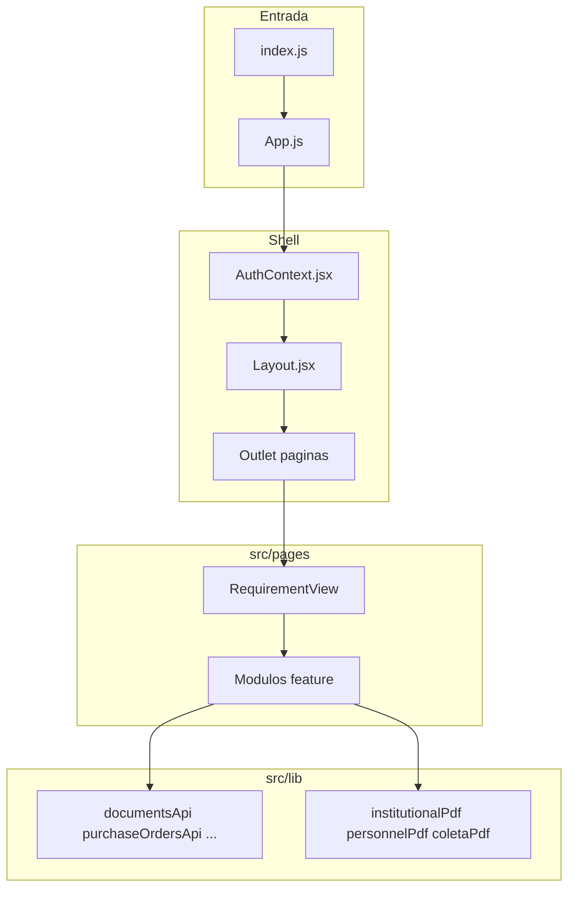

# 00 — Arquitetura geral

[← Índice](./README.md)

## 1. Resumo

O frontend ProcVault QMS é uma SPA React multi-tenant que gere procedimentos, registros e dados operacionais de um laboratório de calibração. A arquitetura separa **páginas** (rotas), **componentes** (UI) e **lib** (lógica, APIs, exportações).

---

## 2. Utilização

### Arranque da aplicação

1. Utilizador acede a `/login` e autentica via Supabase (ou mock em desenvolvimento).
2. `AuthContext` carrega perfil, role e tenant ativo.
3. `HomeRedirect` envia para `/dashboard` ou, se `tecnico_campo`, para a coleta.
4. `Layout` envolve todas as rotas protegidas: sidebar, switch de tenant, outlet das páginas.

### Multi-tenant

- Cada registo de dados pertence a um `tenant_id`.
- O switch de ambiente no `Layout` altera o tenant ativo; APIs filtram por tenant.
- Branding (logo) vem de `tenantBranding.js` + bucket `tenant-branding`.

### Padrão de páginas

| Tipo | Exemplo | Responsabilidade |
|------|---------|------------------|
| Hub | `RequirementView` | Lista documentos ou embarca módulo (Pessoal, Coleta) |
| Lista | `ColetaPage`, `PedidosCompraPage` | Tabela, filtros, ações em lote |
| Editor | `ColetaEditorPage`, editores `/pessoal/*` | Formulário, guardar, exportar |
| Documento | `DocumentEditor` | Editor DOCX rico |

### Checklist de revisão

- [ ] Login e redirect por role funcionam
- [ ] Troca de tenant recarrega dados do ambiente correto
- [ ] Técnico de campo vê apenas navegação de coleta
- [ ] Lazy loading de páginas não falha (chunk retry em `lazyWithRetry.js`)
- [ ] `PageErrorBoundary` captura erros de rota sem derrubar a app

---

## 3. Referência técnica

### Diagrama de camadas

### Ficheiros centrais

| Ficheiro | Função |
|----------|--------|
| `src/index.js` | Bootstrap React |
| `src/App.js` | Definição de rotas, lazy imports, guards (`Protected`, `adminOnly`, etc.) |
| `src/context/AuthContext.jsx` | Sessão Supabase, `user`, `currentTenant`, `currentTenantId`, role |
| `src/components/Layout.jsx` | Sidebar, nav por requisito, tenant switcher, `<Outlet />` |
| `src/components/PageErrorBoundary.jsx` | Error boundary por rota |
| `src/lib/api.js` | Cliente HTTP legacy/mock |
| `src/lib/supabaseClient.js` | Cliente Supabase |
| `src/lib/lazyWithRetry.js` | Import dinâmico com retry |
| `src/lib/roles.js` | Papéis e funções `canAccess*` |

### Guards de rota (`App.js`)

| Guard | Efeito |
|-------|--------|
| `Protected` | Exige autenticação |
| `adminOnly` | Apenas `role === admin` |
| `coletaOnly` | Restringe nav de técnico a rotas de coleta |
| `purchaseOrdersOnly` | `canAccessPurchaseOrders` |
| `quotationRequestsOnly` | `canAccessQuotationRequests` |
| `personnelOnly` | `canAccessPersonnel` |

### Convenções de código

| Convenção | Onde |
|-----------|------|
| APIs em `src/lib/*Api.js` | CRUD Supabase por domínio |
| Rotas em `src/lib/*Routes.js` | Constantes de path |
| Config de nav em `*NavConfig.js`, `*Config.js` | Menu e tópicos |
| Export lazy | `dynamic import()` nos `*Export.js` para code-split |
| ViewModel → Draw → Save | PDFs institucionais (ver [03-EXPORTACOES-PDF.md](./03-EXPORTACOES-PDF.md)) |

### Modos de backend

`api.js` e flags de ambiente permitem:

- **Supabase** — produção
- **Mock** — desenvolvimento local sem backend
- **Legacy API** — compatibilidade HTTP antiga

`documentsApi.js` verifica `isSupabaseDocumentsEnabled()` antes de escolher implementação.

---

## 4. Estado atual e limitações

| Item | Estado |
|------|--------|
| Rotas legacy `/coleta`, `/pessoal/:section` | Redirecionam para novos paths |
| `personnelNavConfig.js` | Parcialmente substituído por `requirementNavConfig` na sidebar |
| Edge functions | Usadas em admin e backup; não documentadas em detalhe aqui |
| Testes automatizados E2E | Não cobertos nesta documentação |
