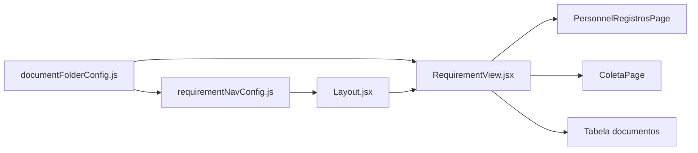

# 01 — Navegação e requisitos

[← Índice](./README.md)

## 1. Resumo

A navegação organiza o QMS por **requisitos ISO** (4 a 8) e **pastas** (`folderKey`). Cada pasta pode ter abas **Procedimentos** e **Registros** (ou módulos especiais). A sidebar é gerada dinamicamente a partir de configuração central.

---

## 2. Utilização

### Aceder a um requisito

1. Na sidebar, expandir requisito (ex.: **6 — Recursos**).
2. Clicar na pasta (ex.: **PR-6.2 Pessoal**).
3. URL: `/requirement/6/pr-6-2`.
4. Abas no topo: **Procedimentos** | **Registros** (e atalhos extras na sidebar).

### Abas por pasta

| Pasta | Abas / comportamento |
|-------|----------------------|
| PR-6.2 Pessoal | Procedimentos (documentos) + **Registros** (dashboard Pessoal embutido) |
| PR-7.2 Calibração | Procedimentos + Registros (Coleta embutida) + atalho sidebar «Coleta de dados» |
| PR-6.6 Produtos externos | Procedimentos + Pedidos de compra + Solicitações de orçamento |
| Demais pastas | Procedimentos + Registros (tabela de documentos Supabase) |

### Atalhos na sidebar (filhos de pasta)

Gerados por `buildFolderSidebarNav()` em `requirementNavConfig.js`:

| Pasta | Atalho extra | Destino |
|-------|--------------|---------|
| PR-6.2 | Níveis e Listas Padrão | `/pessoal/listas` |
| PR-7.2 | Coleta de dados (RE-7.2A) | `/requirement/7/pr-7-2/coleta` |

Requer permissão: `canEditPersonnelStandardOptions` (listas) ou `canAccessColeta` (coleta).

### Query params úteis

| Param | Uso |
|-------|-----|
| `?tab=procedimento` | Aba procedimentos |
| `?tab=registro` | Aba registros / módulo embutido |
| `?topic=re-62a,re-62b` | Filtro multi-tópico no dashboard Pessoal |

### Módulos embutidos em RequirementView

Quando `section === registro` e a pasta é especial, `RequirementView` renderiza o módulo em vez da tabela de documentos:

| Condição | Componente |
|----------|------------|
| Requisito 6 + `pr-6-2` + registro | `PersonnelRegistrosPage` |
| Requisito 7 + `pr-7-2` + registro | `ColetaPage` |

### Checklist de revisão

- [ ] Sidebar mostra Procedimentos, Registros e atalhos sem duplicar entradas
- [ ] PR-6.2 abre por defeito na aba Registros
- [ ] Atalho Coleta leva à listagem standalone
- [ ] Técnico de campo só vê coleta na navegação
- [ ] URLs com `?topic=` filtram corretamente o dashboard Pessoal

---

## 3. Referência técnica

### Diagrama



### Ficheiros

| Ficheiro | Função |
|----------|--------|
| `src/lib/requirementNavConfig.js` | Árvore de requisitos 4–8, pastas, `buildFolderSidebarNav()` |
| `src/lib/documentFolderConfig.js` | Secções por `folderKey`, `defaultSection`, flags (`richEditor`) |
| `src/components/Layout.jsx` | Renderiza nav lateral, aplica filtros de role |
| `src/pages/RequirementView.jsx` | Hub: tabs, lista docs, embed Pessoal/Coleta, export doc |
| `src/lib/dashboardShortcuts.js` | Atalhos do dashboard por role |

### Config PR-6.2 (`documentFolderConfig.js`)

```javascript
"pr-6-2": {
  sections: ["procedimento", "registro"],
  defaultSection: "registro",
  richEditor: true,
}
```

### Config PR-6.6

Abas: procedimentos, pedidos de compra, solicitações de orçamento (sem aba registros genérica).

### IDs de requisito usados no código

| Constante | Valor | Pasta coleta |
|-----------|-------|--------------|
| `PERSONNEL_REQ_ID` | `"6"` | `pr-6-2` |
| `COLETA_REQ_ID` | `"7"` | `pr-7-2` |

Definidos em `personnelRegistrosRoutes.js` e `coletaRoutes.js`.

### Sincronização URL ↔ aba

`RequirementView` lê e escreve `?tab=` na URL ao mudar de secção, permitindo partilha de links diretos.

---

## 4. Estado atual e limitações

| Item | Nota |
|------|------|
| `personnelNavConfig.js` | Define itens dashboard/registros/listas; Layout usa principalmente `requirementNavConfig` |
| Rotas `/pessoal/:section` | Redirecionam para URLs com `?topic=` no requisito 6 |
| KPIs Pessoal | Apenas em `PersonnelRegistrosPage`, não no dashboard global |
