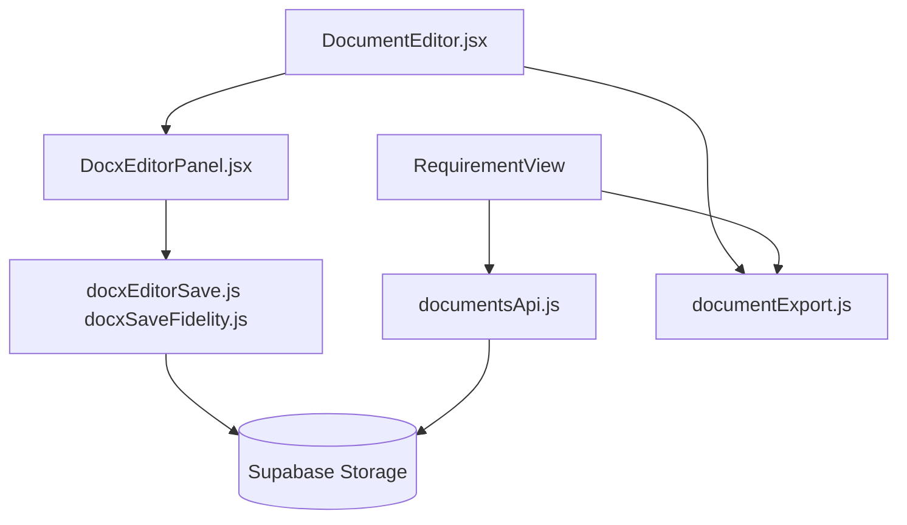

# 02 — Documentos QMS (DOCX e export)

[← Índice](./README.md) · [Exportações PDF](./03-EXPORTACOES-PDF.md) · [Legado DOCX](./DOCX-PROCEDIMENTOS.md)

## 1. Resumo

Gestão de **procedimentos e documentos** do QMS armazenados no Supabase: upload DOCX, edição in-browser, visualização, pin, export PDF/Word e listagem por pasta de requisito.

---

## 2. Utilização

### Quem pode aceder

Utilizadores autenticados com acesso ao tenant. Criação/edição conforme políticas do módulo de documentos (admin/cliente do ambiente).

### Navegação

| Ação | Onde |
|------|------|
| Listar documentos de uma pasta | `/requirement/:id/:folderKey?tab=procedimento` |
| Abrir editor | Clicar documento → `/document/:id` |
| Visualizar só leitura | `/document/:id?mode=view` |
| Export rápido na lista | Ícone PDF/Word no cartão em `RequirementView` |

### Fluxo de edição DOCX

1. Abrir documento com ficheiro `.docx` no Storage.
2. Editor `DocxEditor` carrega em modo **editing** (toolbar ativa).
3. Editar conteúdo no browser.
4. **Salvar** — grava bytes com fidelidade de header/footer (`docxSaveFidelity.js`).
5. **Baixar original** — bytes diretos do Storage, sem passar pelo editor.

### Fluxo visualização

1. Abrir com `?mode=view` ou botão «Visualizar».
2. Modo `viewing` / read-only.
3. «Editar» na barra restaura modo edição.

### Export PDF (do editor DOCX)

- Botão impressão/PDF no editor: `printDocxFromEditor` — usa `ref.print()` + CSS `.docx-printing`.
- Preserva layout Word quando exportado a partir do editor.

### Export PDF (da lista / sem editor)

- `exportDocumentBlob(id, "pdf")` → `documentExport.js`
- Renderiza `content_html` via html2canvas com cabeçalho/rodapé institucional (ver [03](./03-EXPORTACOES-PDF.md)).
- Se documento é DOCX nativo, pode mostrar disclaimer a recomendar export pelo editor.

### Export Word

- Se existe ficheiro `.docx` original → download do Storage.
- Se só HTML editável → gera DOCX via `docx` package (`exportDocxFromHtml`).

### Checklist de revisão

- [ ] Upload DOCX abre em edição com toolbar
- [ ] Salvar não corrompe header/footer do modelo
- [ ] Modo view bloqueia edição; retorno a edit funciona
- [ ] Export PDF pelo editor vs. pela lista — comportamentos distintos documentados
- [ ] Pin e documentos recentes refletem no dashboard
- [ ] PR-6.6: alternar abas mantém sync URL `?tab=`

---

## 3. Referência técnica

### Diagrama



### Ficheiros principais

| Ficheiro | Função |
|----------|--------|
| `src/pages/DocumentEditor.jsx` | Página editor: metadados, save, export, responsáveis |
| `src/pages/RequirementView.jsx` | Lista docs, pin, export cartão, embed módulos |
| `src/components/documents/DocxEditorPanel.jsx` | Wrapper DocxEditor, dirty state |
| `src/lib/documentsApi.js` | CRUD, upload, pin, `exportDocumentBlob` |
| `src/lib/documentFiles.js` | Helpers storage |
| `src/lib/documentExport.js` | `exportDocumentPdf`, `exportDocumentDocx` |
| `src/lib/docxEditorSave.js` | Save, print PDF, relayout |
| `src/lib/docxSaveFidelity.js` | Save seletivo + validação header/footer |
| `src/lib/docxImport.js` | DOCX → HTML preview |
| `src/lib/docxFileUtils.js` | Deteção MIME DOCX |
| `src/lib/blankDocx.js` | Template vazio |
| `src/lib/tenantResponsiblesApi.js` | Responsáveis no cabeçalho |

### API gateway export

```javascript
// documentsApi.js
exportDocumentBlob(docId, format)
  → format === "pdf"  → exportDocumentPdf(doc, { pdfHeaderDisclaimer })
  → format === "docx" → exportDocumentDocx(doc)
```

### Modelo de dados (documento)

Campos usados na UI/export: `id`, `tenant_id`, `title`, `code`, `version`, `content_html`, `has_file`, `file_name`, `file_mime`, `storage_path`, `pinned`, `folder_key`, `requirement_id`.

### Dois caminhos de PDF

| Origem | Método | Qualidade layout |
|--------|--------|------------------|
| Editor DOCX | `printDocxFromEditor` | Alta (print nativo editor) |
| Lista / API | `exportDocumentPdf` (html2canvas) | Rasterizado; cabeçalho institucional overlay |

---

## 4. Estado atual e limitações

| Item | Nota |
|------|------|
| `DOCX-PROCEDIMENTOS.md` | Documentação legada; conteúdo integrado aqui |
| Export PDF lista | Não inclui header/footer Word original do DOCX |
| HTML-only docs | Export DOCX gerado pode perder formatação complexa |
