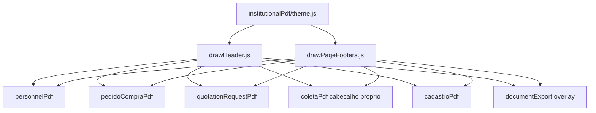

# 03 — Exportações PDF

[← Índice](./README.md)

## 1. Resumo

Todas as exportações PDF institucionais partilham uma **camada visual padronizada** (`institutionalPdf`): fonte Helvetica, cor de texto `[30,30,30]`, cabeçalho com metadados do registro e rodapé **apenas** com `N.PÁG.: X / Y`.

O **conteúdo** de cada documento (tabelas, secções, dados do registro) permanece específico do módulo e **não é unificado**.

---

## 2. Utilização

### Padrão visual esperado em qualquer PDF exportado

| Elemento | Especificação |
|----------|---------------|
| Fonte | Helvetica (bold/normal conforme contexto) |
| Cor texto | Cinza escuro RGB 30,30,30 |
| Cabeçalho | Logo (se disponível) + título + metadados do **próprio** registro |
| Rodapé | `N.PÁG.: {página} / {total}`, alinhado à direita |
| Nomes de ficheiro | **Não padronizados globalmente** — cada módulo mantém o seu padrão |

### Onde exportar (por módulo)

| Módulo | Onde na UI | Formatos |
|--------|------------|----------|
| Pessoal 6.2 | Menu export em listas e editores (`PersonnelExportMenu`) | PDF + Word |
| Coleta RE-7.2A | `ColetaPage` / `ColetaEditorPage` — menu export | PDF + TXT (VBA) |
| Pedido de compra | Lista + editor | PDF |
| Solicitação orçamento | Lista + editor | PDF |
| Proposta comercial RE-7.1A | Lista + editor | PDF |
| Cadastros | Botão «Baixar certificados vigentes» | PDF relatório |
| Documentos QMS | `DocumentEditor` / cartão em `RequirementView` | PDF (+ DOCX à parte) |

### Checklist de revisão

- [ ] Rodapé de todos os PDFs mostra só `N.PÁG.: X / Y` (sem Cód./Ref. duplicados no rodapé)
- [ ] Metadados (código, ref., revisão) aparecem no **cabeçalho**, não no rodapé
- [ ] Coleta: cabeçalho mantém caixa de proposta comercial + `codeLine`
- [ ] PDF multi-página numera todas as páginas
- [ ] Rascunho (pedido/orçamento) exibe watermark «RASCUNHO» sem ocultar rodapé
- [ ] Conteúdo do registro exportado corresponde aos dados guardados na BD

---

## 3. Referência técnica

### Módulo partilhado `institutionalPdf`

| Ficheiro | Exporta |
|----------|---------|
| `src/lib/institutionalPdf/theme.js` | `ML`, `MR`, `PAGE_W`, `TEXT`, `FOOTER_Y`, `CONTENT_BOTTOM`, `LOGO_W/H` |
| `src/lib/institutionalPdf/drawPageFooters.js` | `drawInstitutionalPageFooters(doc, opts?)` |
| `src/lib/institutionalPdf/drawHeader.js` | `drawInstitutionalPdfHeader`, `drawInstitutionalPdfHeaderWithCenterLines`, `drawInstitutionalReportHeader` |
| `src/lib/institutionalPdf/ensureSpace.js` | `ensureInstitutionalSpace` |

`src/lib/personnelPdf/drawPersonnelPdfHeader.js` re-exporta funções do módulo partilhado para compatibilidade com os 6 PDFs de Pessoal.

### Diagrama geral



### Tabela por tipo de exportação

| Tipo | Orquestrador | ViewModel | Draw | Save | Cabeçalho |
|------|-------------|-----------|------|------|-----------|
| Pessoal (6 tipos) | `personnelExport.js` → `personnelPdfExport.js` | `personnelPdf/viewModels.js` | `personnelPdf/draw*.js` | `*ExportFilename(record, "pdf")` | `drawInstitutionalPdfHeader` — meta do registro |
| Coleta | `coletaExport.js` | `coletaPdf/viewModel.js` | `coletaPdf/drawColetaPdf.js` | `coleta-{slug}.pdf` | Custom: proposta + título + codeLine |
| Pedido compra | `pedidosCompraExport.js` | `pedidoCompraPdf/viewModel.js` | `pedidoCompraPdf/drawPedidoCompraPdf.js` | `pedido-{num}.pdf` | `drawInstitutionalPdfHeaderWithCenterLines` |
| Orçamento | `quotationRequestsExport.js` | `quotationRequestPdf/viewModel.js` | `quotationRequestPdf/drawQuotationRequestPdf.js` | `solicitacao-orcamento-{num}.pdf` | Idem + DATA e Nº |
| Proposta comercial | `commercialProposalsExport.js` | `commercialProposalPdf/viewModel.js` | `commercialProposalPdf/drawCommercialProposalPdf.js` | `proposta-{num}.pdf` | `drawInstitutionalPdfHeaderWithCenterLines` |
| Cadastro certs | `cadastroPdf.js` | inline (sem pasta viewModel) | autoTable landscape | `certificados-*-vigentes-{data}.pdf` | `drawInstitutionalReportHeader` |
| Documento Supabase | `documentsApi.exportDocumentBlob` → `documentExport.js` | `doc` record | html2canvas + overlay jsPDF | blob → download | `drawDocumentPdfPageHeader` |

### Fluxo Pessoal (exemplo)

```
UI: PersonnelExportMenu.onExportPdf
  → personnelExport.exportAdequacyPdf(id, tenant)
    → personnelPdfExport: getAdequacy + logo + assinaturas
    → dynamic import drawAdequacyPdf.js
      → buildAdequacyPdfViewModel(record)
      → drawInstitutionalPdfHeader + corpo + drawInstitutionalPageFooters
      → doc.save(adequacyExportFilename(...))
```

### Fluxo Coleta

```
UI: exportColetaPdf(row, tenantName, opts)
  → buildColetaPdfViewModel(row, tenantName, { envCerts, weightItems, tenant })
  → drawColetaPdf: página 1 frente + página 2 verso
  → drawInstitutionalPageFooters(doc) no final
  → doc.save(`coleta-${slug}.pdf`)
```

### Fluxo Documentos Supabase

```
exportDocumentPdf(doc)
  → HTML (content_html) renderizado off-screen, fonte Helvetica
  → html2canvas → imagem
  → jsPDF: fatias por página com margem superior (cabeçalho) e inferior (rodapé)
  → drawDocumentPdfPageHeader por página (title, version, code)
  → drawInstitutionalPageFooters
  → retorna Blob
```

### Lazy loading (code-split)

| Chunk | Importado de |
|-------|--------------|
| `personnel-pdf` | `personnelPdfExport.js` |
| `coleta-pdf` | `coletaExport.js` |
| `pedido-compra-pdf` | `pedidosCompraExport.js` |
| `quotation-request-pdf` | `quotationRequestsExport.js` |

### Logo

Camadas UI carregam logo do tenant como `logoDataUrl` (data URL PNG) antes de chamar exportadores que suportam imagem no cabeçalho.

### Ficheiros draw por tipo Pessoal

| Documento | Draw | Código |
|-----------|------|--------|
| Competência | `drawCompetencyPdf.js` | RE-6.2C |
| Adequação | `drawAdequacyPdf.js` | RE-6.2A |
| Monitoramento | `drawMonitoringPdf.js` | RE-6.2E |
| Experiência | `drawExperienceEvaluationPdf.js` | RE-6.2B |
| Seleção | `drawPersonnelSelectionPdf.js` | PR-6.2F |
| Lista presença | `drawAttendanceListPdf.js` | RE-6.2D |

### Nomes de ficheiro Pessoal

`personnelExportFilename.js` — padrão:

`{CÓDIGO} - {Título} Rev. {rev} {DD.MM.AA} - {assunto}.pdf|.docx`

---

## 4. Estado atual e limitações

| Item | Estado |
|------|--------|
| Coleta Word | Não implementado |
| `ColetaPdfFrente.jsx` / `Verso.jsx` | Preview JSX; export ativo usa `drawColetaPdf.js` (jsPDF) |
| `exportPersonnelDocument(type, format)` | Definido em `personnelExport.js`; não usado na UI |
| `buildColetaDocumentModel` | Exportado; não referenciado na UI atual |
| Padronização | Apenas camada visual; conteúdo e filenames por módulo inalterados |
