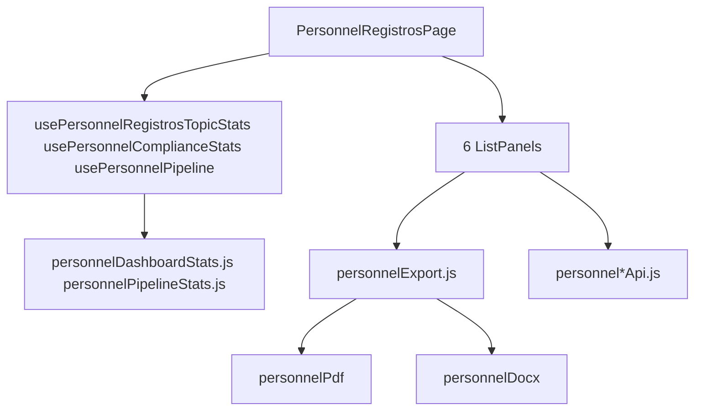

# 04 — PR-6.2 Pessoal

[← Índice](./README.md) · [Exportações PDF](./03-EXPORTACOES-PDF.md)

## 1. Resumo

Módulo de gestão de **competência e autorização de pessoal** (NBR ISO 17025 — item 6.2). Cobre seis tipos de registro (A a F), dashboard de registros com KPIs, pipeline de onboarding e exportação PDF/Word por registro.

**Procedimento:** PR-6.2 · **Registros:** RE-6.2A a RE-6.2E e PR-6.2F

---

## 2. Utilização

### Quem pode aceder

`canAccessPersonnel` — admin, client, diretor, gerente_qualidade, gerente_tecnico, administrativo_vendas.

Listas padrão: `canEditPersonnelStandardOptions` — admin, client, gerente_qualidade, diretor.

### Navegação

| Destino | URL |
|---------|-----|
| Dashboard registros (principal) | `/requirement/6/pr-6-2` (aba Registros por defeito) |
| Procedimentos DOCX | `/requirement/6/pr-6-2?tab=procedimento` |
| Níveis e Listas Padrão | `/pessoal/listas` ou sidebar «Níveis e Listas Padrão» |
| Editor por tipo | `/pessoal/{secao}/:id` ou `/pessoal/{secao}/nova` |

### Os seis tópicos (ordem A → F)

| ID | Código | Documento | Uso |
|----|--------|-----------|-----|
| `re-62a` | RE-6.2A | Adequação de competência | Autorizar ocupante no cargo |
| `re-62b` | RE-6.2B | Avaliação do período de experiência | Supervisão inicial |
| `re-62c` | RE-6.2C | Competência do cargo | Requisitos por função |
| `re-62d` | RE-6.2D | Lista de presença | Registro de treinamento |
| `re-62e` | RE-6.2E | Monitoramento de pessoal | Manutenção da competência |
| `pr-62f` | PR-6.2F | Seleção de pessoal | Processo de contratação |

### Dashboard de registros (`PersonnelRegistrosPage`)

Ordem vertical dos painéis (de cima para baixo):

1. **Cartões por tópico** — contagem clicável; ativa filtro multi-tópico
2. **KPIs de ambiente** — adequações pendentes, monitoramentos em atraso, experiências pendentes
3. **Filtros globais** — pesquisa, intervalo de datas, chips de tópicos com X para remover
4. **Botão «Limpar filtros»** — repõe estado inicial
5. **Painéis colapsáveis** — uma lista por tópico (A–F)
6. **Pipeline de onboarding** — no **final** da página (seleção → admissão → experiência → adequação)

**Filtro multi-tópico na URL:** `?topic=re-62a,re-62b`

### Fluxos principais

**Criar registro**

1. Abrir painel do tópico → «Novo».
2. Preencher formulário no editor dedicado.
3. Guardar → registro na BD do tenant.

**Exportar**

1. Na lista ou no editor: menu `PersonnelExportMenu`.
2. Escolher PDF ou Word.
3. Ficheiro gerado com metadados do registro (ver [03-EXPORTACOES-PDF.md](./03-EXPORTACOES-PDF.md)).

**Pipeline de onboarding**

1. Seleção aprovada (`pr-62f`) aparece no pipeline.
2. Etapas: aguardando admissão → em experiência → experiência aprovada → adequação concluída.
3. Links levam a cadastro de colaboradores ou editores de experiência/adequação.

### Checklist de revisão

- [ ] Stats dos cartões carregam ao abrir a página (sem precisar expandir painéis)
- [ ] Filtro multi-tópico e chips funcionam; URL reflete seleção
- [ ] Ordem dos tópicos: A, B, C, D, E, F
- [ ] Pipeline no final da página com estados corretos
- [ ] Export PDF e Word em todos os 6 tipos
- [ ] Rotas legacy `/pessoal/cargos` etc. redirecionam ou abrem editor

---

## 3. Referência técnica

### Diagrama

### Páginas

| Ficheiro | Rota | Função |
|----------|------|--------|
| `PersonnelRegistrosPage.jsx` | Embutido em RequirementView | Dashboard registros |
| `PersonnelPage.jsx` | `/pessoal/listas` | Listas padrão |
| `PositionEditorPage.jsx` | `/pessoal/cargos/:id` | RE-6.2C |
| `CompetencyAdequacyEditorPage.jsx` | `/pessoal/adequacao/:id` | RE-6.2A |
| `ExperienceEvaluationEditorPage.jsx` | `/pessoal/avaliacao-experiencia/:id` | RE-6.2B |
| `AttendanceListEditorPage.jsx` | `/pessoal/presenca/:id` | RE-6.2D |
| `PersonnelMonitoringEditorPage.jsx` | `/pessoal/monitoramento/:id` | RE-6.2E |
| `PersonnelSelectionEditorPage.jsx` | `/pessoal/selecao/:id` | PR-6.2F |

### Componentes principais

| Componente | Função |
|------------|--------|
| `PositionsListPanel.jsx` | Lista competências |
| `AdequaciesListPanel.jsx` | Lista adequações |
| `ExperienceEvaluationsListPanel.jsx` | Lista experiências |
| `AttendanceListsListPanel.jsx` | Listas presença |
| `MonitoringsListPanel.jsx` | Monitoramentos |
| `SelectionsListPanel.jsx` | Seleções |
| `PersonnelExportMenu.jsx` | Dropdown PDF/Word |
| `PersonnelTopicCountCard.jsx` | Cartão contagem tópico |
| `PersonnelEnvKpiCard.jsx` | KPI ambiente |
| `PersonnelOnboardingPipeline.jsx` | Tabela pipeline |
| `StandardOptionsPanel.jsx` | Níveis e listas padrão |

### Hooks

| Hook | Ficheiro | Retorno |
|------|----------|---------|
| `usePersonnelRegistrosTopicStats` | `hooks/usePersonnelRegistrosTopicStats.js` | Contagens e linhas filtradas por tópico |
| `usePersonnelComplianceStats` | `hooks/usePersonnelComplianceStats.js` | KPIs compliance |
| `usePersonnelPipeline` | `hooks/usePersonnelPipeline.js` | Linhas do pipeline |
| `usePersonnelPrefill` | `hooks/usePersonnelPrefill.js` | Pré-preenchimento entre registros |

### Config e lib

| Ficheiro | Função |
|----------|--------|
| `personnelRegistrosConfig.js` | `PERSONNEL_REGISTRO_TOPICS`, grupos, `getVisibleTopics()` |
| `personnelRegistrosRoutes.js` | Paths, parsing `?topic=` |
| `personnelRegistrosListUtils.js` | Filtros, stats por tópico |
| `personnelListPanelHelpers.js` | `useFilteredPersonnelRows` |
| `personnelDocMeta.js` | Códigos e títulos default dos 6 formulários |
| `personnelDashboardStats.js` | Queries Supabase + agregação |
| `personnelPipelineStats.js` | `buildPersonnelPipelineRows` |
| `personnelOnboardingRoutes.js` | URLs de próximo passo |

### APIs Supabase (por tópico)

| API | Tabela / domínio |
|-----|------------------|
| `personnelPositionsApi.js` | Cargos / competências |
| `personnelAdequaciesApi.js` | Adequações |
| `personnelExperienceEvaluationsApi.js` | Avaliações experiência |
| `personnelAttendanceListsApi.js` | Listas presença |
| `personnelMonitoringsApi.js` | Monitoramentos |
| `personnelSelectionsApi.js` | Seleções |
| `personnelStandardOptionsApi.js` | Opções padrão (listas) |
| `employeeRegistrationsApi.js` | Colaboradores (liga seleção → admissão) |

### Exportação

| Camada | Ficheiro |
|--------|----------|
| Facade | `personnelExport.js` |
| PDF fetch + assets | `personnelPdfExport.js` |
| ViewModels | `personnelPdf/viewModels.js` |
| Draw PDF | `personnelPdf/draw*.js` (6 ficheiros) |
| DOCX | `personnelDocx/generatePersonnelDocx.js`, `docxHelpers.js` |
| Filenames | `personnelExportFilename.js` |

Assinaturas: carregadas de `employee_registrations.signature_storage_path` para adequação, monitoramento e seleção.

### Metadados default (`personnelDocMeta.js`)

| Tipo | code | reference |
|------|------|-----------|
| competency | RE-6.2C | RE-6.2 |
| adequacy | RE-6.2A | RE-6.2 |
| monitoring | RE-6.2E | RE-6.2 |
| experienceEvaluation | RE-6.2B | PR-6.2 |
| personnelSelection | PR-6.2F | PR-6.2 |
| attendanceList | RE-6.2D | PR-6.2 |

Cada registro guarda também `document_code`, `document_reference`, `document_revision`, `document_model_issue_date` na BD.

---

## 4. Estado atual e limitações

| Item | Nota |
|------|------|
| KPIs no dashboard global | Não existem; só em PersonnelRegistrosPage |
| `personnelNavConfig.js` | Legado; sidebar usa `requirementNavConfig` |
| `exportPersonnelDocument()` | API genérica não ligada à UI |
| Word Coleta | Fora de âmbito deste módulo |
