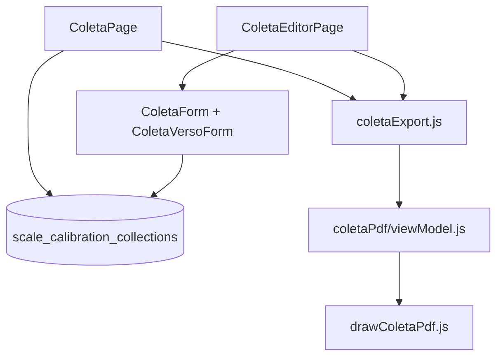

# 05 — PR-7.2 Coleta de dados (RE-7.2A)

[← Índice](./README.md) · [Exportações PDF](./03-EXPORTACOES-PDF.md)

## 1. Resumo

Formulário digital de **coleta de dados para calibração de balança** (registro RE-7.2A), integrado no requisito 7 — PR-7.2 Calibração de Balanças. Inclui listagem, editor de duas faces (frente/verso), export PDF do formulário e export TXT para importação VBA.

---

## 2. Utilização

### Quem pode aceder

`canAccessColeta` — admin, client, tecnico_campo.

Técnicos de campo (`tecnico_campo`) têm navegação restrita à coleta.

### Navegação

| Destino | URL |
|---------|-----|
| Lista (embutida no requisito) | `/requirement/7/pr-7-2?tab=registro` |
| Lista standalone | `/requirement/7/pr-7-2/coleta` |
| Nova coleta | `/requirement/7/pr-7-2/coleta/nova` |
| Editar | `/requirement/7/pr-7-2/coleta/:id` |
| Legacy | `/coleta` → redirect para lista |

Atalho na sidebar: **Coleta de dados (RE-7.2A)**.

### Fluxo operacional

**Nova coleta**

1. «Nova coleta» na listagem.
2. Preencher **frente**: cliente, balança, ambiente, excentricidade, pontos de calibração.
3. Preencher **verso**: descrição da carga, questões, repetitividade (se aplicável).
4. Guardar → registro em `scale_calibration_collections`.

**Exportar**

| Formato | Uso |
|---------|-----|
| **PDF** | Formulário RE-7.2A impresso (2 páginas, cabeçalho com proposta + metadados tenant) |
| **TXT** | Ficheiro VBA (`ABA;COLUNA;VALOR`) para importação em sistema legado |

Após export, o sistema regista `pdf_downloaded_at` e/ou `tsv_downloaded_at` para KPIs.

### KPIs na listagem

| KPI | Significado |
|-----|-------------|
| Total coletas | Registos no tenant |
| Exportações completas | PDF e TXT ambos descarregados |
| Arquivos pendentes | Falta PDF ou TXT |

### Metadados do formulário (tenant)

Configuráveis em **Cadastros → Config. RE-7.2A**:

- Código (default RE-7.2A)
- Título
- Revisão (ex.: Rev. 03 de 14.05.26)
- Referência (default PR-7.2)

Por registro: **Referente à Proposta Comercial** (`commercial_proposal_ref`).

### Checklist de revisão

- [ ] Lista e editor acessíveis por ambas as rotas (embutida e standalone)
- [ ] PDF: 2 páginas, cabeçalho com proposta e codeLine, rodapé só `N.PÁG.`
- [ ] TXT VBA abre corretamente no destino esperado
- [ ] KPIs de exportação atualizam após download
- [ ] Certificados ambiente e pesos padrão resolvem labels no PDF
- [ ] Config tenant reflete-se no cabeçalho exportado

---

## 3. Referência técnica

### Diagrama



### Páginas e componentes

| Ficheiro | Função |
|----------|--------|
| `pages/ColetaPage.jsx` | Lista, filtros, KPIs, export por linha |
| `pages/ColetaEditorPage.jsx` | Criar/editar, guardar, export |
| `components/coleta/ColetaForm.jsx` | Formulário frente |
| `components/coleta/ColetaVersoForm.jsx` | Formulário verso |
| `components/coleta/PesoPadraoMultiSelect.jsx` | Seleção pesos padrão |
| `components/coleta/ColetaTechniciansPanel.jsx` | Técnicos |
| `components/cadastros/ColetaTenantConfig.jsx` | Config formulário no cadastro |

### Lib principal

| Ficheiro | Função |
|----------|--------|
| `coletaRoutes.js` | Constantes de URL |
| `coletaSchema.js` | Schema payload, `COLETA_DOC_CODE`, merge payload |
| `coletaDocMeta.js` | Metadados formulário por tenant |
| `coletaListUtils.js` | Filtros, `coletaKpis()` |
| `coletaExport.js` | `exportColetaPdf`, `exportColetaTsv` |
| `coletaVbaMapping.js` | Linhas TXT formato VBA |
| `coletaExportModel.js` | Modelo documento (não usado na UI atual) |

### PDF (`coletaPdf/`)

| Ficheiro | Função |
|----------|--------|
| `viewModel.js` | `buildColetaPdfViewModel`, `coletaPdfFileSlug` |
| `drawColetaPdf.js` | Gerador ativo jsPDF (2 páginas) |
| `coletaPdfLayout.js` | Barras secção, tabelas, cores formulário |
| `coletaPdfColors.js` | Paleta azul + cor texto institucional |
| `renderToPdf.jsx` | Re-export `drawColetaPdf` |
| `ColetaPdfFrente.jsx` / `Verso.jsx` | Preview JSX (não usado no export) |

### Fluxo export PDF

```
exportColetaPdf(row, tenantName, { logoDataUrl, envCerts, weightItems, tenant })
  → buildColetaPdfViewModel(row, tenantName, opts)
  → drawHeader (proposta + título + codeLine)
  → drawFrente + addPage + drawVerso
  → drawInstitutionalPageFooters(doc)
  → doc.save(`coleta-${slug}.pdf`)
```

`slug` = `{scale_serial}-{calibration_date}` sanitizado.

### Fluxo export TXT

```
exportColetaTsv(row, { envCerts, weightItems })
  → buildColetaVbaLines(row, { envCerts })
  → Blob UTF-8 BOM → coleta-{slug}.txt
```

### Payload (`coletaSchema.js`)

Estrutura JSON em `row.payload` com secções: `cliente`, `balanca`, `ambiente`, `excentricidade`, `calibracao`, `verso` (descrição carga, questões, repetitividade).

### Dependências de cadastro

| Cadastro | Uso na coleta |
|----------|---------------|
| Certificados termo-baro | Labels em ambiente |
| Pesos padrão (identificação) | IDs em pontos de calibração |
| Config RE-7.2A | Metadados cabeçalho PDF |
| Técnicos de campo | Painel técnicos |

### Tabela Supabase

`scale_calibration_collections` — campos principais: `tenant_id`, `scale_serial`, `calibration_date`, `commercial_proposal_ref`, `payload` (jsonb), `pdf_downloaded_at`, `tsv_downloaded_at`.

---

## 4. Estado atual e limitações

| Item | Nota |
|------|------|
| Export Word | Não implementado |
| Componentes React PDF | Legado/preview; export usa jsPDF |
| Nome ficheiro | `coleta-{slug}.pdf` (não usa padrão longo de Pessoal) |
| Cabeçalho Coleta | Layout próprio (caixa proposta); rodapé padronizado institucional |
