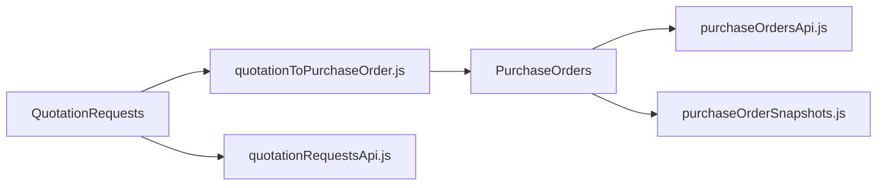

# 06 — PR-6.6 Pedidos de compra e Solicitações de orçamento

[← Índice](./README.md) · [Exportações PDF](./03-EXPORTACOES-PDF.md)

Documentação detalhada legada: [PEDIDOS-COMPRA.md](./PEDIDOS-COMPRA.md) · [SOLICITACOES-ORCAMENTO.md](./SOLICITACOES-ORCAMENTO.md)

## 1. Resumo

Módulo **PR-6.6 — Produtos e serviços externos**: solicitações de orçamento (RE-6.6C) e pedidos de compra (RE-6.6E), com workflow de status, conversão orçamento→pedido, snapshots de cadastros e export PDF institucional.

---

## 2. Utilização

### Quem pode aceder

`canAccessPurchaseOrders` e `canAccessQuotationRequests` — admin, client, diretor, gerente_qualidade, gerente_tecnico, administrativo_vendas.

### Navegação

| Módulo | URL principal | Também em |
|--------|---------------|-----------|
| Solicitações | `/solicitacoes-orcamento` | `/requirement/6/pr-6-6?tab=solicitacoes_orcamento` |
| Pedidos | `/pedidos-compra` | `/requirement/6/pr-6-6?tab=pedidos_compra` |

### Fluxo orçamento → pedido

1. Criar solicitação (um tipo por solicitação).
2. Avançar status até **aprovada**.
3. «Converter em pedido de compra» — gera pedido em rascunho.
4. Preencher valores, pagamento e assinaturas no editor do pedido.
5. Ligação bidirecional: `quotation_request_id` no pedido + tabela `quotation_request_conversions`.

**Treinamento** não gera pedido (sem equivalente RE-6.6E).

### Fluxos independentes

**Solicitação:** criar → enviar → receber orçamento → analisar → aprovar/reprovar/cancelar → (opcional) converter.

**Pedido:** criar manual ou via conversão → aprovação técnica → envio fornecedor → recebimento → inspeção → assinaturas.

### Export PDF

- Lista ou editor → botão/menu PDF.
- Cabeçalho institucional com metadados do modelo (Cód./Ref./Rev./Emissão).
- Rodapé `N.PÁG.: X / Y`.
- Rascunho: watermark «RASCUNHO».

### Checklist de revisão

- [ ] Status transitions corretas em lista e editor
- [ ] Conversão idempotente (não duplica pedidos)
- [ ] Snapshots não mudam se cadastro for alterado depois
- [ ] PDF pedido inclui inspeção de recebimento quando preenchida
- [ ] PDF orçamento mostra só tipo selecionado
- [ ] Campo «Conforme cotação nº» preenchido em pedidos convertidos

---

## 3. Referência técnica

### Diagrama



### Páginas e componentes

| Área | Ficheiros |
|------|-----------|
| Orçamentos | `QuotationRequestsPage.jsx`, `QuotationRequestEditorPage.jsx`, `components/quotationRequests/*` |
| Pedidos | `PedidosCompraPage.jsx`, `PedidoCompraEditorPage.jsx`, `components/purchaseOrders/*` |
| Status | `PurchaseOrderStatusPanel.jsx`, `purchaseOrderStatusFlow.js` |
| Inspeção | `purchaseOrderInspectionFields.js` |

### Lib — Orçamentos

| Ficheiro | Função |
|----------|--------|
| `quotationRequestsApi.js` | CRUD, status, conversão |
| `quotationRequestTypes.js` | 7 tipos, status, colunas |
| `quotationRequestStatusFlow.js` | Transições |
| `quotationRequestValidations.js` | Validações |
| `quotationRequestSnapshots.js` | Snapshots cliente/fornecedor |
| `quotationRequestPdf/viewModel.js` | View model PDF |
| `quotationRequestPdf/drawQuotationRequestPdf.js` | jsPDF |
| `quotationRequestsExport.js` | Entry export lazy |

### Lib — Pedidos

| Ficheiro | Função |
|----------|--------|
| `purchaseOrdersApi.js` | CRUD, inspeção, status, duplicar |
| `purchaseOrderTypes.js` | 6 tipos serviço, status |
| `purchaseOrderStatusFlow.js` | Workflow visual |
| `purchaseOrderCalculations.js` | Totais |
| `purchaseOrderSnapshots.js` | Snapshots imutáveis |
| `pedidoCompraPdf/viewModel.js` | View model PDF |
| `pedidoCompraPdf/drawPedidoCompraPdf.js` | jsPDF, colunas por tipo |
| `pedidosCompraExport.js` | Entry export lazy |
| `quotationToPurchaseOrder.js` | Mapeamento QR → PO |

### Export PDF — fluxo

```
UI → exportQuotationRequestPdf(request, { logoDataUrl })
  → buildQuotationRequestPdfViewModel(request)
  → drawQuotationRequestPdf → drawInstitutionalPageFooters → doc.save()

UI → exportPedidoCompraPdf(order, { logoDataUrl, employees })
  → drawPedidoCompraPdf → drawInstitutionalPageFooters
  → pedidosCompraExport: doc.save(`pedido-{num}.pdf`)
```

### Tabelas Supabase (referência)

- `quotation_requests`, `quotation_request_items`, `quotation_request_conversions`
- `purchase_orders`, `purchase_order_items`, `purchase_order_inspections`, `purchase_order_signatures`
- Migrações: `20250629000000_quotation_requests.sql`, `20250630000000_quotation_po_conversion.sql`, `20250627000000_tenant_billing_purchase_orders.sql`

### Mapeamento tipo orçamento → pedido

| Solicitação | Pedido |
|-------------|--------|
| ensaio_proficiencia | ensaio_proficiencia |
| auditoria_interna | auditoria_interna |
| calibracao_termo_baro_higrometro | calibracao_termo_baro_higrometro |
| calibracao_pesos_padrao | calibracao_pesos_padrao |
| aquisicao_termo_baro_higrometro | compra_termo_baro_higrometro |
| aquisicao_pesos_padrao | compra_pesos |
| treinamento | *(sem conversão)* |

---

## 4. Estado atual e limitações

| Item | Nota |
|------|------|
| PR-6.6 aba Registros | Removida; registros são as próprias solicitações e pedidos |
| Edição após status final | Permitida em pedidos (com reabertura de status) |
| Import cadastro em linhas | Pesos: manual; termo: import opcional de equipamento |
| Backup tenant | Inclui pasta `pedidos_compra/` no ZIP |
