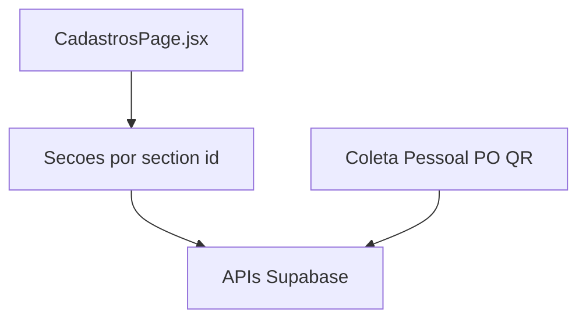

# 07 — Cadastros (dados mestres)

[← Índice](./README.md) · [Exportações PDF](./03-EXPORTACOES-PDF.md)

## 1. Resumo

Módulo de **cadastros transversais** ao QMS: fornecedores, clientes, colaboradores, certificados e equipamentos (pesos padrão, termo-baro-higrômetro), configuração RE-7.2A e técnicos de campo. Alimenta coleta, pessoal, pedidos e orçamentos via snapshots ou seleção direta.

---

## 2. Utilização

### Quem pode aceder

Utilizadores autenticados do tenant. Secções filtradas por role em `getVisibleCadastroSections()`.

| Secção | Restrição |
|--------|-----------|
| Config. RE-7.2A | admin, client |
| Técnicos de campo | `canManageTechnicians` (admin, client) |

### Navegação

| URL | Secção |
|-----|--------|
| `/cadastros` | Redirect → `/cadastros/fornecedores` |
| `/cadastros/fornecedores` | Fornecedores |
| `/cadastros/clientes` | Clientes |
| `/cadastros/colaboradores` | Colaboradores (+ assinaturas) |
| `/cadastros/cert-peso` | Certificados de peso padrão (conjuntos) |
| `/cadastros/pesos` | Pesos padrão individuais |
| `/cadastros/thermo` | Termo-baro-higrômetro |
| `/cadastros/config-coleta` | Metadados formulário RE-7.2A |
| `/cadastros/tecnicos` | Técnicos de campo |

Atalhos no dashboard para termo-baro e pesos padrão (`dashboardShortcuts.js`).

### Fluxos principais

**Colaborador com assinatura**

1. Cadastrar em Colaboradores.
2. Upload assinatura (`signature_storage_path`).
3. Usado em export PDF de adequação, monitoramento, seleção e assinaturas de pedidos.

**Certificados vigentes (relatório PDF)**

1. Em «Certificado de peso padrão» ou «Termo-baro-higrômetro».
2. Botão «Baixar certificados vigentes».
3. Gera PDF landscape com registos cuja validade >= hoje.

**Config coleta**

1. Admin/client abre Config. RE-7.2A.
2. Define código, título, revisão do formulário.
3. Reflete no cabeçalho PDF das coletas exportadas.

### Checklist de revisão

- [ ] Secções ocultas corretamente por role
- [ ] Assinaturas aparecem nos PDFs de pessoal que as requerem
- [ ] Relatório PDF certificados vigentes lista só não vencidos
- [ ] Pesos e certificados ambiente resolvem labels na coleta
- [ ] Snapshots em pedidos/orçamentos não alteram com mudança posterior no cadastro

---

## 3. Referência técnica

### Diagrama

### Ficheiros

| Ficheiro | Função |
|----------|--------|
| `src/pages/CadastrosPage.jsx` | Shell com submenu e secções |
| `src/lib/cadastroSections.js` | `CADASTRO_SECTIONS`, visibilidade por role |
| `src/lib/cadastroConstants.js` | Enums, labels |
| `src/lib/cadastroListUtils.js` | Pesquisa/filtro listas |
| `src/lib/cadastroPdf.js` | PDF relatórios certificados vigentes |
| `src/components/cadastros/*` | Formulários por secção |
| `src/components/cadastros/ColetaTenantConfig.jsx` | Config RE-7.2A |
| `src/components/cadastros/PesoItemSection.jsx` | Pesos individuais |
| `src/lib/employeeRegistrationsApi.js` | Colaboradores |

### Export PDF cadastro

| Função | Entrada | Saída |
|--------|---------|-------|
| `downloadWeightCertificatesValidPdf(rows, tenantName)` | `weight_standard_certificates` | `certificados-peso-padrao-vigentes-{data}.pdf` |
| `downloadEnvironmentCertificatesValidPdf(rows, tenantName)` | `environment_sensor_certificates` | `certificados-termo-baro-vigentes-{data}.pdf` |

Fluxo: `drawInstitutionalReportHeader` + autoTable landscape + `drawInstitutionalPageFooters`.

### Tabelas Supabase (referência)

| Tabela | Uso |
|--------|-----|
| `supplier_registrations` | Fornecedores → snapshots PO/QR |
| `client_registrations` | Clientes |
| `employee_registrations` | Colaboradores, assinaturas, pipeline pessoal |
| `weight_standard_certificates` | Conjuntos certificados peso |
| `weight_standard_items` | Pesos individuais → coleta |
| `environment_sensor_certificates` | Termo-baro → coleta |
| `tenants` | Config coleta (`coleta_form_*`) |

### Consumidores dos cadastros

| Módulo | Dados usados |
|--------|--------------|
| Coleta | Pesos, certs ambiente, config tenant, técnicos |
| Pessoal | Colaboradores, assinaturas, listas padrão |
| Pedidos / Orçamentos | Fornecedores, tenant billing, colaboradores |
| Dashboard | Atalhos para cadastros |

---

## 4. Estado atual e limitações

| Item | Nota |
|------|------|
| PDF cadastro | Relatório simples; sem logo tenant no cabeçalho |
| Import pesos em pedido calibração | Campos manuais (sem import automático do cadastro) |
| RLS | `cadastro_tenant_access(tenant_id)` em tabelas de cadastro
