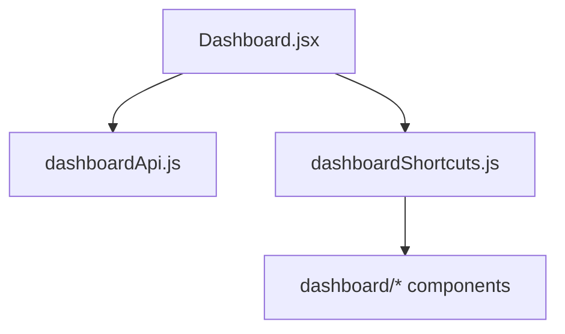

# 08 — Dashboard, backup e administração

[← Índice](./README.md)

## 1. Resumo

**Dashboard** — página inicial com atalhos, documentos recentes/fixados, lembretes e gráfico de distribuição. **Backup** — export/import ZIP do tenant. **AdminClients** — gestão de ambientes CTLI (apenas administrador).

---

## 2. Utilização

### Dashboard (`/dashboard`)

**Quem acede:** todos os utilizadores autenticados (exceto redirect de técnico para coleta).

**Secções:**

| Secção | Conteúdo |
|--------|----------|
| Atalhos | Cards para Coleta, Pedidos, Orçamentos, Cadastros (filtrados por role) |
| Documentos recentes | Últimos documentos abertos no tenant |
| Documentos fixados | Pin manual na RequirementView |
| Lembretes | Criar/eliminar (admin e client) |
| Gráfico | Distribuição de documentos por requisito |

**Nota:** KPIs do módulo Pessoal **não** aparecem no dashboard global — estão em `PersonnelRegistrosPage`.

### Backup (`/backup`)

1. Listar backups disponíveis do tenant.
2. Descarregar ZIP gerado pela edge function `tenant-backup`.
3. Restaurar conforme fluxo implementado em `BackupView.jsx`.

Conteúdo do ZIP inclui documentos, cadastros, coletas, pedidos de compra, etc. (ver função Supabase).

### AdminClients (`/admin/clients`)

**Quem acede:** `role === admin` (CTLI).

- Criar/editar tenants (clientes)
- Configurar dados legais, faturação, formulário RE-7.2A
- Gestão de utilizadores do ambiente (via edge functions)

### Home redirect

| Role | Destino após login |
|------|-------------------|
| `tecnico_campo` | Coleta (`COLETA_LIST_PATH`) |
| Demais | `/dashboard` |

### Checklist de revisão

- [ ] Atalhos dashboard respeitam permissões por role
- [ ] Lembretes só para admin/client
- [ ] Recentes e fixados atualizam após abrir documento
- [ ] Backup gera ZIP completo do tenant
- [ ] AdminClients inacessível para roles não-admin
- [ ] Técnico não vê dashboard como home

---

## 3. Referência técnica

### Diagrama dashboard

### Ficheiros dashboard

| Ficheiro | Função |
|----------|--------|
| `src/pages/Dashboard.jsx` | Página principal |
| `src/lib/dashboardApi.js` | `fetchDashboard(tenantId)` — recentes, pin, stats |
| `src/lib/dashboardShortcuts.js` | `DASHBOARD_SHORTCUTS`, `getVisibleDashboardShortcuts(role)` |
| `src/components/dashboard/DashboardShortcutCard.jsx` | Card atalho |
| `src/components/dashboard/DashboardRecentDocs.jsx` | Lista recentes |
| `src/components/dashboard/DashboardPinnedDocs.jsx` | Lista fixados |
| `src/components/dashboard/DashboardReminders.jsx` | CRUD lembretes |
| `src/components/dashboard/DashboardPieChart.jsx` | Gráfico requisitos |

### Atalhos configurados (`dashboardShortcuts.js`)

| ID | Destino | Requer |
|----|---------|--------|
| coleta | `/requirement/7/pr-7-2/coleta` | `canAccessColeta` |
| pedidos-compra | PR-6.6 pedidos | `canAccessPurchaseOrders` |
| solicitacao-orcamento | PR-6.6 orçamentos | `canAccessQuotationRequests` |
| termo-baro-higro | `/cadastros/thermo` | secção visível |
| pesos-padrao | `/cadastros/pesos` | secção visível |
| propostas | — | `enabled: false` (futuro) |

### Ficheiros backup e admin

| Ficheiro | Função |
|----------|--------|
| `src/pages/BackupView.jsx` | UI backup download/restore |
| `src/lib/backupApi.js` | Chamadas Supabase backup |
| `src/lib/mockBackupZip.js` | Mock dev |
| `src/pages/AdminClients.jsx` | Gestão tenants CTLI |
| `src/lib/supabaseFunctions.js` | Edge functions admin |
| `supabase/functions/tenant-backup/` | Geração ZIP servidor |

### Permissões (`roles.js`)

| Função | Roles |
|--------|-------|
| `canManageDashboardReminders` | admin, client |
| `isCtliAdmin` | admin |
| `isTechnicianOnlyNav` | tecnico_campo |

### Auth e tenant

| Ficheiro | Função |
|----------|--------|
| `src/context/AuthContext.jsx` | Sessão, tenant ativo, perfil |
| `src/components/tenant/TenantSwitchDialog.jsx` | Confirmação troca ambiente |
| `src/lib/tenantSwitchNotice.js` | Toast pós-troca |
| `src/lib/tenantBranding.js` | Logo para exports |

---

## 4. Estado atual e limitações

| Item | Nota |
|------|------|
| KPI Pessoal no dashboard | Não implementado |
| Atalho «Propostas» | Desativado (`enabled: false`) |
| Edge functions | Documentação de implementação servidor fora deste frontend |
| Mock mode | Dashboard e backup podem usar dados mock em dev |
