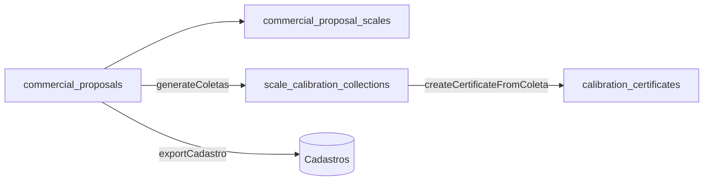

# 09 — PR-7.1 Proposta Comercial (RE-7.1A)

[← Índice](./README.md) · [Exportações PDF](./03-EXPORTACOES-PDF.md) · [Coleta 7.2](./05-COLETA-7-2.md)

## 1. Resumo

Módulo **RE-7.1A Proposta Comercial**: cadastro multi-balança vinculado ao cliente, exportação PDF institucional, exportação para cadastros (cliente + balanças) e geração de coletas de dados (uma por balança) com pré-preenchimento.

---

## 2. Utilização

### Quem pode aceder

`canAccessCommercialProposals` — admin, client, diretor, gerente_qualidade, gerente_tecnico, administrativo_vendas.

### Navegação

| Módulo | URL principal | Também em |
|--------|---------------|-----------|
| Propostas | `/propostas-comerciais` | `/requirement/7/pr-7-1?tab=propostas_comerciais` |
| Config. RE-7.1A | `/cadastros/config-proposta` | Textos institucionais do PDF (metadados via Lista Mestra) |

### Fluxo completo

1. Criar proposta → cliente + N balanças + pontos de calibração + valores.
2. Exportar PDF (RE-7.1A).
3. (Opcional) Exportar para cadastro → `end_customer_registrations` + `scale_registrations`.
4. (Opcional) Gerar coletas → uma `scale_calibration_collections` por balança.
5. Preencher coleta em campo → gerar certificado (fluxo PR-7.2 existente).

Coleta **standalone** (`/requirement/7/pr-7-2/coleta/nova`) permanece disponível sem vínculo à proposta.

### Checklist de revisão

- [ ] PDF: cabeçalho institucional, tabela de balanças, textos configuráveis por tenant
- [ ] Exportação cadastro: não duplica série ativa do mesmo cliente
- [ ] Geração de coleta: uma por balança; não duplica se `collection_id` já existe
- [ ] Coleta vinculada: link «Ver proposta» e ref somente leitura
- [ ] Certificado: `commercial_proposal_ref` propagado da coleta

---

## 3. Referência técnica

### Diagrama

### Tabelas Supabase

| Tabela | Função |
|--------|--------|
| `commercial_proposals` | Cabeçalho da proposta |
| `commercial_proposal_scales` | Balanças (N por proposta) |
| `commercial_proposal_calibration_points` | Pontos 1–10 por balança |
| `scale_calibration_collections` | FKs `commercial_proposal_id`, `commercial_proposal_scale_id` |

### Código principal

| Área | Ficheiros |
|------|-----------|
| API | `src/lib/commercialProposals/commercialProposalApi.js` |
| Coleta | `src/lib/commercialProposals/commercialProposalToColeta.js` |
| Cadastro | `src/lib/commercialProposals/commercialProposalCadastroExport.js` |
| PDF | `src/lib/commercialProposals/commercialProposalsExport.js`, `src/lib/commercialProposalPdf/*` |
| UI | `src/pages/CommercialProposalsPage.jsx`, `CommercialProposalEditorPage.jsx`, `src/components/commercialProposals/*` |
| Config tenant | `src/components/cadastros/CommercialProposalTenantConfig.jsx` |

### Template Lista Mestra

`template_key`: `re-71a-proposta-comercial-pdf`

Código **RE-7.1A**, título, revisão e referência **PR-7.1** são definidos na Lista Mestra (PR-8.3). Na criação da proposta, o sistema grava um snapshot desses metadados no registo; a exportação PDF usa sempre a revisão vigente da Lista Mestra.
