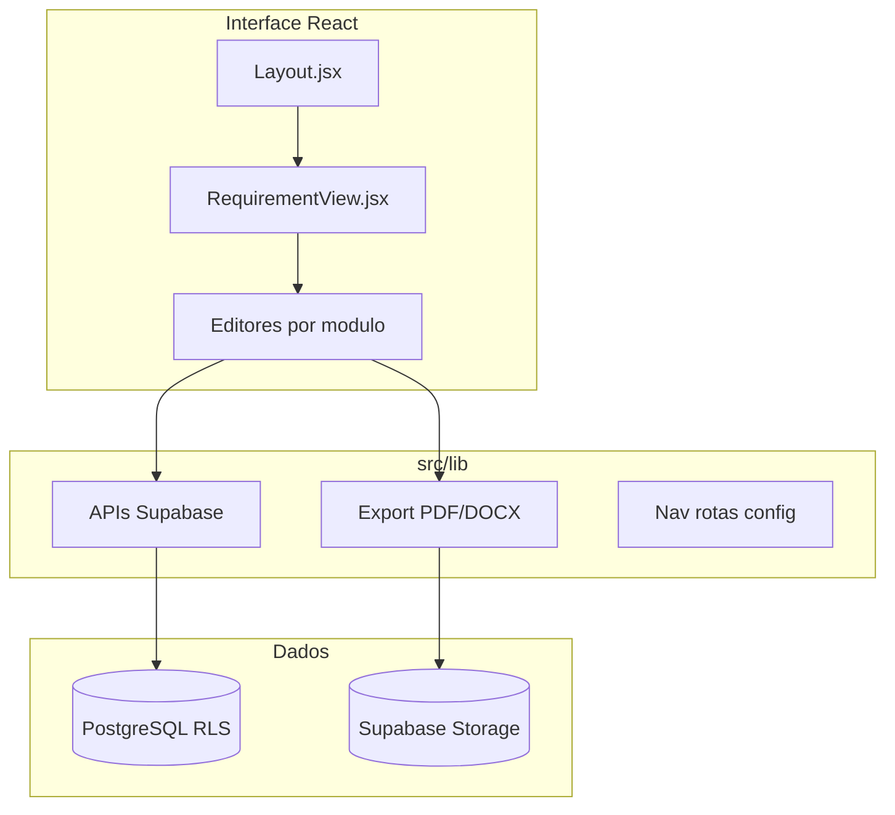

# ProcVault QMS — Documentação do Sistema

Documentação modular para **revisão e controle** do frontend ProcVault QMS (gestão de qualidade para laboratório de calibração CTLI, requisitos ISO 17025 — pastas 4 a 8).

Cada módulo descreve **utilização** (manual operacional) e **referência técnica** (arquivos, fluxos de código, APIs). Atualize sob pedido quando novas funcionalidades forem implementadas.

---

## Índice de módulos

| Doc | Módulo | Descrição |
|-----|--------|-----------|
| [00-ARQUITETURA.md](./00-ARQUITETURA.md) | Arquitetura geral | Stack, App shell, auth, multi-tenant, padrões de código |
| [01-NAVEGACAO-REQUISITOS.md](./01-NAVEGACAO-REQUISITOS.md) | Navegação | Sidebar, requisitos 4–8, tabs Procedimentos/Registros |
| [02-DOCUMENTOS-DOCX.md](./02-DOCUMENTOS-DOCX.md) | Documentos QMS | Editor DOCX, export PDF/Word, RequirementView |
| [03-EXPORTACOES-PDF.md](./03-EXPORTACOES-PDF.md) | Exportações PDF | Padrão institucional, todos os geradores PDF |
| [04-PESSOAL-6-2.md](./04-PESSOAL-6-2.md) | PR-6.2 Pessoal | Registros A–F, KPIs, pipeline, editores, export |
| [05-COLETA-7-2.md](./05-COLETA-7-2.md) | PR-7.2 Coleta | RE-7.2A, formulário, export PDF/TXT |
| [06-PEDIDOS-ORCAMENTOS.md](./06-PEDIDOS-ORCAMENTOS.md) | PR-6.6 Compras | Pedidos de compra + solicitações de orçamento |
| [07-CADASTROS.md](./07-CADASTROS.md) | Cadastros | Dados mestres, certificados, config coleta |
| [08-DASHBOARD-ADMIN.md](./08-DASHBOARD-ADMIN.md) | Dashboard e Admin | Atalhos, lembretes, backup, AdminClients |

### Documentação legada (referência)

| Ficheiro | Nota |
|----------|------|
| [DOCX-PROCEDIMENTOS.md](./DOCX-PROCEDIMENTOS.md) | Pipeline DOCX original (resumido em 02) |
| [PEDIDOS-COMPRA.md](./PEDIDOS-COMPRA.md) | Detalhe pedidos (integrado em 06) |
| [SOLICITACOES-ORCAMENTO.md](./SOLICITACOES-ORCAMENTO.md) | Detalhe orçamentos (integrado em 06) |

---

## Visão geral do sistema

### Stack tecnológica

| Camada | Tecnologia |
|--------|------------|
| Framework | React 19 + Create React App (CRACO) |
| Roteamento | react-router-dom v7 |
| Estilo | Tailwind CSS + componentes Radix/shadcn |
| Backend | Supabase (auth, PostgreSQL, storage, edge functions) |
| Documentos | @eigenpal/docx-editor-react, docx, mammoth |
| PDF | jsPDF, jspdf-autotable, html2canvas |
| Formulários | react-hook-form + zod |

### Organização do código

| Pasta | Função |
|-------|--------|
| `src/pages/` | Ecrãs ligados a rotas (27 páginas) |
| `src/components/` | UI por feature + `ui/` (primitivos) |
| `src/lib/` | Lógica de negócio, APIs, PDF/DOCX, config de rotas |
| `src/hooks/` | Hooks React reutilizáveis |
| `src/context/` | `AuthContext` — utilizador, tenant, role |
| `supabase/` | Migrações SQL e edge functions |

---

## Mapa de rotas principais

| Rota | Página | Módulo |
|------|--------|--------|
| `/login` | Login | Auth |
| `/dashboard` | Dashboard | Início |
| `/requirement/:id` | RequirementView | Hub requisitos |
| `/requirement/:id/:folderKey` | RequirementView | Pasta (PR-6.2, PR-7.2, etc.) |
| `/document/:id` | DocumentEditor | Procedimentos DOCX |
| `/cadastros/:section` | CadastrosPage | Dados mestres |
| `/pedidos-compra`, `/pedidos-compra/:id` | Pedidos | PR-6.6 |
| `/solicitacoes-orcamento`, `/solicitacoes-orcamento/:id` | Orçamentos | PR-6.6 |
| `/pessoal/cargos/:id` etc. | Editores Pessoal | PR-6.2 |
| `/requirement/7/pr-7-2/coleta` | ColetaPage | PR-7.2 |
| `/requirement/7/pr-7-2/coleta/:id` | ColetaEditorPage | PR-7.2 |
| `/backup` | BackupView | Backup tenant |
| `/admin/clients` | AdminClients | Admin CTLI |

Rotas completas em `src/App.js`. Constantes de path em `src/lib/*Routes.js`.

---

## Glossário

### Tipos de documento

| Prefixo | Significado | Exemplo |
|---------|-------------|---------|
| **PR** | Procedimento | PR-6.2 Pessoal, PR-7.2 Calibração |
| **RE** | Registro / formulário | RE-6.2A Adequação, RE-7.2A Coleta |

### Conceitos

| Termo | Definição |
|-------|----------|
| **Tenant / Ambiente** | Cliente ou instância isolada no Supabase (RLS por `tenant_id`) |
| **Requisito** | Pasta ISO no menu (4 Gerais … 8 Gestão) |
| **folderKey** | Identificador da pasta (`pr-6-2`, `pr-7-2`, `pr-6-6`) |
| **Snapshot** | Cópia imutável de cadastro no momento do registro (pedidos, orçamentos) |
| **ViewModel** | Objeto preparado para exportação PDF/DOCX a partir do registro |

### Roles (papéis)

Definidos em `src/lib/roles.js`:

| Role | Label | Acesso típico |
|------|-------|---------------|
| `admin` | Administrador CTLI | Tudo + AdminClients |
| `client` | Conta cliente | Módulos do tenant |
| `tecnico_campo` | Técnico de campo | Apenas coleta |
| `diretor` | Diretor | Pessoal, compras, orçamentos |
| `gerente_qualidade` | Gerente Qualidade | Idem + listas padrão pessoal |
| `gerente_tecnico` | Gerente Técnico | Idem |
| `administrativo_vendas` | Adm/Vendas | Compras e orçamentos |

Funções de permissão: `canAccessColeta`, `canAccessPersonnel`, `canAccessPurchaseOrders`, `canAccessQuotationRequests`, `canEditPersonnelStandardOptions`, `isTechnicianOnlyNav`.

---

## Como usar esta documentação

1. **Revisão operacional** — abra o módulo relevante, secção «Utilização» e «Checklist de revisão».
2. **Controle técnico** — secção «Referência técnica»: tabelas de ficheiros, diagramas de fluxo, APIs.
3. **Exportações** — consulte sempre [03-EXPORTACOES-PDF.md](./03-EXPORTACOES-PDF.md) para o padrão visual institucional.
4. **Atualização** — quando pedir atualização, indique o módulo alterado; mantenha o índice neste README.

---

## Critérios de qualidade da documentação

- Reflete o **estado atual** do código no repositório frontend
- Não substitui migrações SQL nem políticas RLS — apenas referencia
- Nomes de ficheiro e funções correspondem ao código em `src/`
