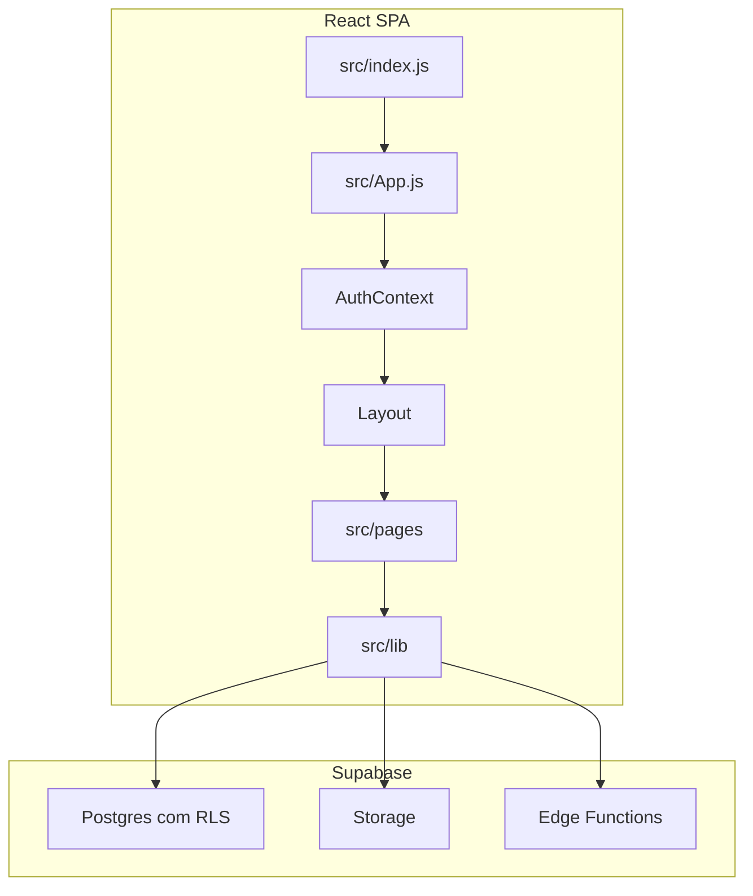
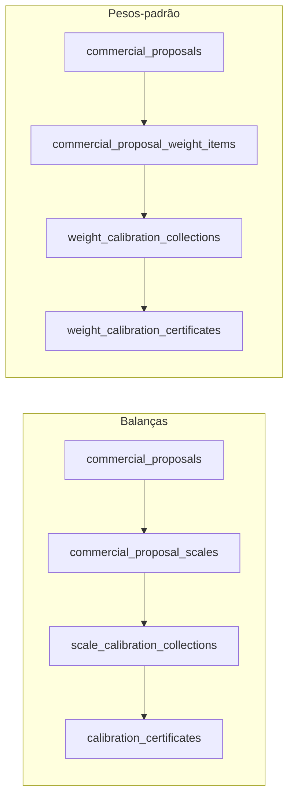

# QUATI — Baseline do sistema

**Documento:** rascunho de orientação DevSistem (08/10/2026). Descreve o sistema como está no código. Não é registo oficial da Qualidade, não substitui o FOR-SGQ-010A e não declara o sistema validado.

**Para quê:** ponto de partida único antes de evoluir o produto. Os textos em `docs/` e o pacote CSV em `docs/csv/` continuam válidos para o detalhe de cada tema; este ficheiro diz onde cada função vive e como as peças se ligam.

Versão de software de referência: npm `0.1.0`. Nome comercial: QUATI. Dono de negócio: laboratório de calibração (balanças e pesos-padrão), alinhado à ISO/IEC 17025.

---

## 1. Como ler este ficheiro

| Precisa de | Abra |
|------------|------|
| Mapa geral, papéis, pastas, cadeias e tabelas | Este ficheiro |
| Arranque, deploy, variáveis | [README.md](../README.md), [DEPLOY.md](../DEPLOY.md) |
| Navegação, DOCX, PDF, pessoal, coleta, compras, dashboard, backup | `docs/00` a `docs/11` |
| Inventário BPx, riscos, rastreabilidade, controlos eletrónicos | [docs/csv/](./csv/00-INVENTARIO.md) |

Notas antigas podem estar parciais. Exemplo: [00-ARQUITETURA.md](./00-ARQUITETURA.md) e [01-NAVEGACAO-REQUISITOS.md](./01-NAVEGACAO-REQUISITOS.md) ainda dizem que a aba Registros de PR-7.2 embute `ColetaPage`. No código atual, `RequirementView` embute `ColetaHubPage` quando a aba é `coleta_dados` ou `registro`, e embute as listas de certificados nas abas de emissão. Os editores continuam em rotas próprias. Em caso de conflito, prevalece o código citado aqui.

---

## 2. O que o sistema é

QUATI é uma SPA React que gere o sistema de gestão e os registos operacionais do laboratório. A pasta do repositório chama-se `frontend` por histórico: o mesmo repositório contém a aplicação e o backend Supabase (migrações SQL, Storage e Edge Functions). Não há uma segunda API obrigatória.

| Camada | Onde | Função |
|--------|------|--------|
| Entrada | `src/index.js` | Monta React em modo estrito |
| Rotas e guards | `src/App.js` | URLs, lazy load, `Protected` |
| Sessão | `src/context/AuthContext.jsx` | Utilizador, papel, tenant, ACL, aceites legais |
| Casca | `src/components/Layout.jsx` | Sidebar por requisito, troca de tenant, outlet |
| Páginas | `src/pages/` | Ecrãs (lista, editor, hub) |
| Domínio | `src/lib/` | APIs, cálculos, PDF, rotas, schemas |
| UI partilhada | `src/components/ui/` | Radix + Tailwind |
| Dados | `supabase/migrations/` | Schema, RLS, seeds |
| Servidor | `supabase/functions/` | Utilizadores, backup, e-sign, e-mail de certificado |

Stack: React 19, React Router 7, CRACO, Tailwind, Supabase JS, jsPDF, docx / editor DOCX. Hospedagem prevista do estático: Vercel. Base de dados, autenticação, ficheiros e funções: Supabase.

Três modos de dados, escolhidos em `src/lib/api.js`:

- **Supabase** — produção (`REACT_APP_SUPABASE_URL` e chave anónima ou publicável).
- **Mock** — `REACT_APP_USE_MOCK_API=true`, sem backend.
- **HTTP legado** — `REACT_APP_BACKEND_URL` opcional, só para transição. Documentos, dashboard e backup já usam Supabase.

---

## 3. Sessão, tenant e portões

### Arranque

1. `/login` autentica no Supabase (ou no mock).
2. `AuthContext` lê `profiles`: papel, `tenant_id`, flags `access_coleta` / `access_certificados`, `access_acl`, aceites de termos e privacidade, `must_change_password`, `is_disabled`.
3. `HomeRedirect` envia para `restrictedNavHomePath` em `src/lib/roleNav.js`.
4. `Layout` envolve as rotas autenticadas.

Páginas públicas, fora do layout: `/termos`, `/licenca`, `/privacidade`.

### Multi-tenant

Cada registo operacional pertence a um `tenant_id`. O administrador CTLI (`role = admin`) pode trocar de ambiente. Os outros papéis ficam no tenant do perfil.

`tenants.deployment_model` (`src/lib/tenantAccess.js`):

| Valor | Significado |
|-------|-------------|
| `full` | Ambiente interno CTLI. Árvore de requisitos completa, com pastas exclusivas do admin. |
| `client_portal` | Portal do cliente. Requisitos 5–8 reduzidos e módulos operacionais listados em `CLIENT_PORTAL_*`. |

Branding (logo) vem do tenant e do bucket de branding.

### Portões

| Portão | Onde | Efeito |
|--------|------|--------|
| `Protected` | `App.js` | Exige sessão. Flags: `adminOnly`, `coletaOnly`, `certificatesOnly`, `purchaseOrdersOnly`, `quotationRequestsOnly`, `commercialProposalsOnly`, `personnelOnly`, `masterDocumentsOnly` |
| `TenantModuleGate` | `src/components/tenant/TenantModuleGate.jsx` | Módulo ligado no tenant (`pedidos_compra`, `solicitacao_orcamento`, `backup`, …) |
| `RequirementAccessGate` | o mesmo ficheiro | Requisito e pasta permitidos ao papel, ao tenant e à ACL |
| `CadastroSectionGate` | o mesmo ficheiro | Secção de cadastro visível |

Pastas só do administrador CTLI estão em `CTLI_ONLY_FOLDER_KEYS` (`src/lib/ctliOnlyFolders.js`). Requisito 4 inteiro é exclusivo CTLI. No requisito 7, contas que não são admin só veem `pr-7-1`, `pr-7-2` e `pr-7-6`, e mesmo assim sujeitas ao papel e à ACL.

### Casas por papel restrito

| Papel | Página inicial |
|-------|----------------|
| `tecnico_campo` | Hub de coleta `/requirement/7/pr-7-2/coleta` |
| `signatario` | Hub de aprovação `/aprovacao` |
| `diretor` | `/dashboard` |
| Demais | `/dashboard` |

A conta `client` usa sidebar própria (`usesClientSidebarNav`). Os outros papéis usam a árvore ISO filtrada, salvo a navegação restrita.

Na sidebar (`Layout.jsx`), `tecnico_campo`, `signatario` e `diretor` não veem a árvore de requisitos. O diretor só tem o atalho Dashboard. O signatário só tem o atalho Aprovação. O técnico não tem atalho extra na sidebar: entra pelo hub de coleta e as rotas de coleta continuam autorizadas pelo guard. Ajuda e menu do utilizador aparecem para todos.

---

## 4. Papéis e ACL

Valores alinhados ao `CHECK` de `profiles`. Definição: `src/lib/roles.js`.

| Valor | Rótulo | Acesso de base (sem ACL) |
|-------|--------|--------------------------|
| `admin` | Administrador CTLI | Tudo, incluindo `/admin/clients` e pastas CTLI-only |
| `client` | Conta cliente (portal) | Dono do ambiente: coleta, certificados, propostas, pessoal, lista mestra, compras, orçamentos, técnicos e utilizadores do tenant |
| `gerente_geral` | Gerente geral | Operação ampla no tenant, incluindo técnicos. Gestão de utilizadores do tenant fica em `admin` e `client` |
| `tecnico_campo` | Técnico de campo | Coleta. Sem certificados, sem emissão, sem edição de certificado |
| `signatario` | Signatário | Certificados para aprovar. Sem coleta, sem editar e sem emitir |
| `diretor` | Diretor | Dashboard. Sem coleta e sem lista de certificados |
| `gerente_qualidade` | Gerente da Qualidade | Requisitos 6 e 8; pessoal, lista mestra, compras e orçamentos. Coleta e certificados só com toggle |
| `gerente_tecnico` | Gerente técnico | Requisito 7; propostas e pessoal. Coleta e certificados só com toggle |
| `administrativo_vendas` | Administrativo / Vendas | Requisito 7, pasta `pr-7-1`, e propostas. Coleta e certificados só com toggle |
| `administrativo_compras` | Administrativo / Compras | Requisito 6, pasta `pr-6-6`, compras e orçamentos. Sem coleta e sem certificados |

Toggles `access_coleta` e `access_certificados` aplicam-se a `gerente_qualidade`, `gerente_tecnico` e `administrativo_vendas`.

**ACL v1** (`profiles.access_acl`, `src/lib/accessAcl.js`): quando `version === 1`, os módulos em `access_acl.modules` passam a decidir coleta, certificados, propostas, pessoal, lista mestra, pedidos e orçamentos. Módulos selecionáveis na UI: `coleta`, `propostas`, `certificados`, `pedidos_compra`, `solicitacao_orcamento`, `lista_mestra`, `cadastros`, `pessoal`. A pasta PR-6.6 na ACL também abre compras e orçamentos.

Ações críticas de certificado (`roles.js`):

| Ação | Quem |
|------|------|
| Aprovar | `admin`, `client`, `gerente_geral`, `signatario` |
| Emitir | `admin`, `client`, `gerente_geral`, ou toggle de certificados. Nunca técnico, signatário ou diretor |
| Editar / criar | Os mesmos da emissão, com a mesma exclusão de técnico, signatário e diretor |
| Enviar e-mail | Quem acede a certificados, exceto diretor |

Aprovação e emissão oficiais passam pela Edge Function `critical-esign` (`approve_scale`, `approve_weight`, `emit_scale`, `emit_weight`), com palavra-passe do ator.

---

## 5. Navegação ISO 17025

A sidebar não é um menu plano de módulos. É a árvore dos requisitos 4 a 8, em `src/lib/requirementNavConfig.js`. O URL usa `folderKey` sem dois-pontos: `/requirement/7/pr-7-2`.

A aba ativa vem só da query `?tab=`. `RequirementView` não guarda a aba em estado local. Pastas sem modo especial mostram **Procedimentos** e **Registros** (`src/lib/documentFolderConfig.js`) e listam `tenant_documents`. O editor rico é `/document/:id`.

### Catálogo de pastas

Tipo **transacional** = ecrã de negócio com tabelas próprias. Tipo **prateleira** = documentos controlados, sem motor de workflow (NC, CAPA, reclamações, auditorias, etc.).

| Req. | Pasta | Tipo | O que abre |
|------|-------|------|------------|
| 4 | `pr-4-1` Confidencialidade e imparcialidade | Prateleira, só CTLI | Procedimentos + registos |
| 5 | `manual-qualidade` | Prateleira | Só procedimentos, sem abas |
| 5 | `politica-qualidade` | Prateleira | Registos |
| 5 | `documentacao-legal` | Prateleira | Ficheiro, sem editor rico |
| 5 | `estrutura-organizacional` | Prateleira | Registos |
| 5 | `assinaturas` | Prateleira | Assinaturas |
| 6 | `pr-6-2` Pessoal | Transacional | Procedimento + RE-6.2A a F |
| 6 | `pr-6-4` Equipamentos | Transacional | Procedimento, ficha técnica, cronograma + cadastros |
| 6 | `pr-6-4-10` Checagens intermédias | Prateleira, só CTLI | Procedimentos + registos |
| 6 | `pr-6-4-12` Manutenção | Transacional | Verificação de equipamento e programa de manutenção |
| 6 | `pr-6-5` Rastreabilidade metrológica | Prateleira, só CTLI | Procedimentos + registos |
| 6 | `pr-6-6` Produtos externos | Transacional | Procedimento, pedidos de compra, solicitações de orçamento |
| 7 | `pr-7-1` Análise crítica de pedidos | Transacional | Procedimento + propostas comerciais |
| 7 | `pr-7-1-7` Atendimento ao cliente | Prateleira, só CTLI | Procedimentos + registos |
| 7 | `pr-7-2` Calibração de balanças | Transacional | Procedimento; aba de coleta embute `ColetaHubPage`; abas de emissão embutem as listas de certificados. Editores em rotas próprias |
| 7 | `pr-7-2-2` Validação de métodos | Prateleira, só CTLI | Procedimentos + registos |
| 7 | `pr-7-4` Manuseio de itens | Prateleira, só CTLI | Procedimentos + registos |
| 7 | `pr-7-6` Incerteza de medição | Prateleira | Procedimentos + registos. O motor de cálculo está no certificado, não nesta pasta |
| 7 | `pr-7-7` Garantia da validade | Prateleira, só CTLI | Procedimentos + registos |
| 7 | `pr-7-8` Relato de resultados | Prateleira, só CTLI | Procedimentos + registos. O PDF do certificado é o relato operacional |
| 7 | `pr-7-9` Reclamações | Prateleira, só CTLI | Procedimentos + registos |
| 7 | `pr-7-10` Trabalho não conforme | Prateleira, só CTLI | Procedimentos + registos |
| 7 | `pr-7-11` Controlo de dados | Prateleira, só CTLI | Procedimentos + registos |
| 8 | `pr-8-3` Documentos | Transacional | Lista mestra (internos, externos, software, revisões, distribuição, templates, gerados, alertas, configurações) |
| 8 | `pr-8-4` a `pr-8-9` | Prateleira, só CTLI | Registos documentais: registos, riscos, satisfação, ações corretivas, auditorias, análise crítica |

---

## 6. Cadeia crítica: proposta, coleta, certificado

Dois trilhos exclusivos. Uma proposta é só balanças (`proposal_kind = balancas`) ou só pesos-padrão (`pesos`). A UI e a validação não misturam os dois no mesmo documento (`src/lib/commercialProposals/commercialProposalSchema.js`).

Códigos documentais:

| Peça | Balanças | Pesos-padrão |
|------|----------|--------------|
| Coleta | RE-7.2A | RE-5.4.2A |
| Certificado | RE-7.2B | RE-5.4.2B |
| Pasta | PR-7.2 | PR-7.2 |

Geração a partir da proposta: uma coleta por item, com cliente, equipamento e nominais pré-preenchidos.

- Balanças: `generateColetasFromProposal` em `src/lib/commercialProposals/commercialProposalToColeta.js`.
- Pesos: `generateWeightColetasFromProposal` em `src/lib/commercialProposals/commercialProposalToWeightColeta.js`.

Quando a coleta está ligada à proposta, o técnico vê cabeçalho e nominais em leitura e preenche condições e leituras. Voz na coleta de pesos confirma o cabeçalho antes de TBH e leituras (`src/lib/voice/`, `src/components/voice/`). Ao marcar preenchida ou conferida, o sistema grava aviso e `dashboard_reminders`.

### 6.1 Proposta comercial RE-7.1A

| | |
|--|--|
| Rotas | `/propostas-comerciais`, `/propostas-comerciais/nova`, `/propostas-comerciais/:id`. Atalho da pasta: `/requirement/7/pr-7-1?tab=propostas_comerciais` |
| Páginas | `CommercialProposalsPage`, `CommercialProposalEditorPage` |
| API | `src/lib/commercialProposals/commercialProposalApi.js` |
| Tabelas | `commercial_proposals`, `commercial_proposal_scales`, `commercial_proposal_calibration_points`, `commercial_proposal_weight_items` |
| Saídas | PDF institucional (`commercialProposalPdf/`). Configuração do modelo em `/requirement/7/pr-7-1/config/re-71a` (admin CTLI) |
| Numeração | Par natural `proposal_year` + `proposal_number` por tenant |

### 6.2 Coleta e certificado de balanças

| | |
|--|--|
| Hub | `/requirement/7/pr-7-2/coleta` (`ColetaHubPage`). A mesma página também abre embutida em PR-7.2 nas abas `coleta_dados` e `registro` |
| Lista / editor | `.../coleta/balancas`, `.../nova`, `.../:id` |
| Certificados | `.../certificados`, `.../nova`, `.../:id`. A lista também abre embutida na aba `emissao_cert_balancas` |
| Páginas | `ColetaPage`, `ColetaEditorPage`, `CertificateListPage`, `CertificateNewPage`, `CertificateEditorPage` |
| API coleta | `src/lib/coletaApi.js` |
| API certificado | `src/lib/calibrationCertificates/certificateApi.js` |
| Tabelas | `scale_calibration_collections`; `calibration_certificates`, `calibration_certificate_points`, `calibration_certificate_standards`, `calibration_certificate_environmental`, `calibration_certificate_conformity`, `calibration_certificate_reviews`, `certificate_email_deliveries` |
| Redirecionamentos antigos | `/coleta` e `/coleta/:id` apontam para as rotas novas |

Workflow da coleta (`COLETA_WORKFLOW_STATUSES`):

`rascunho` → `preenchida` → `conferida` → `aprovada_certificado` → `certificado_gerado`, com saída `cancelada`.

Certificado oficial só nasce de coleta `conferida` ou `aprovada_certificado`. Os outros estados geram pré-visualização.

Workflow do certificado (`canTransitionCertificateStatus`):

| De | Para |
|----|------|
| `rascunho` | `calculado`, `cancelado`, `obsoleto` |
| `calculado` | `em_revisao_tecnica`, `aguardando_aprovacao`, `rascunho`, `cancelado`, `obsoleto` |
| `em_revisao_tecnica` | `aguardando_aprovacao`, `calculado`, `cancelado`, `obsoleto` |
| `aguardando_aprovacao` | `aprovado`, `reprovado`, `cancelado`, `obsoleto` |
| `aprovado` | `emitido`, `enviado`, `cancelado`, `obsoleto` |
| `reprovado` | `calculado`, `rascunho`, `cancelado`, `obsoleto` |
| `emitido` / `enviado` | `substituido`, `cancelado`, `enviado` |
| `substituido` / `cancelado` | `obsoleto` |
| `obsoleto` | nenhum. Só este estado permite apagar |

Editáveis: `rascunho`, `calculado`, `em_revisao_tecnica`, `reprovado`. Bloqueados: `aprovado`, `emitido`, `enviado`, `substituido`, `cancelado`, `obsoleto`. Inativos (não contam como certificado vivo da coleta): `cancelado`, `substituido`, `obsoleto`.

Tipos: `rbc` e `rastreavel`. Conformidade do ponto: `conforme`, `nao_conforme`, `nao_avaliado`, `nao_aplicavel`.

E-mail ao cliente: Edge Function `send-calibration-certificate`. Entrega registada em `certificate_email_deliveries`. PDF oficial só quando `status = emitido` e não é pré-visualização (`src/lib/certificateExport.js`).

### 6.3 Coleta e certificado de pesos-padrão

Espelho do trilho de balanças, com tabelas e páginas próprias. Os nomes de estado são os mesmos.

| | |
|--|--|
| Coleta | `/requirement/7/pr-7-2/pesos/coleta`. O hub de PR-7.2 é o mesmo das balanças; a lista de pesos é rota própria |
| Certificados | `.../pesos/certificados`. A lista também abre embutida na aba `emissao_cert_peso_padrao` |
| Páginas | `WeightColetaPage`, `WeightColetaEditorPage`, `WeightCertificateListPage`, `WeightCertificateNewPage`, `WeightCertificateEditorPage` |
| Schema | `src/lib/weightCalibration/weightColetaSchema.js`, `weightCertificateSchema.js` |
| Tabelas | `weight_calibration_collections`, `weight_calibration_certificates`, `weight_calibration_certificate_items`, `weight_calibration_certificate_standards`, `weight_calibration_certificate_environmental`, `weight_calibration_certificate_reviews`, `weight_certificate_email_deliveries` |
| Limite | Até 24 itens por certificado |
| Classes | E1, E2, F1, F2, M1, M1-2, M2, M2-3, M3 |
| E-mail | `send-weight-calibration-certificate` |

### 6.4 Motor de cálculo

Incerteza, empuxo, arredondamento e conformidade de balanças correm no browser, em `src/lib/certificateCalculations/`. Não há serviço de cálculo no servidor.

| Ficheiro | Responsabilidade |
|----------|------------------|
| `pointCalculations.js` | Média, erro de indicação, repetibilidade, resolução, contribuição do padrão, incerteza expandida, excentricidade, Veff |
| `environmentalCalculations.js` | Médias ambientais, densidade do ar |
| `conventionalMassCorrection.js` | Correção de massa convencional (empuxo) |
| `buoyancyCalculations.js` | Incerteza de empuxo |
| `conformityCalculations.js` | Classe do instrumento, tolerância OIML, conformidade do ponto |
| `certificateDisplayRounding.js` | Arredondamento de apresentação |
| `materialConstants.js` | Densidade por material |

O trilho de pesos tem cálculos próprios ao lado (`standardWeightCalculations`, correção TBH). As derivações e os ensaios de regressão estão nos testes `*.test.js` e em `docs/csv/QO-FORMULAS.md`. Este baseline não reproduz as fórmulas.

### 6.5 Aprovação

`/aprovacao` (`ApprovalHubPage`) junta o que espera o signatário. Atalho de balanças pendentes aponta para este hub (`CERTIFICATE_PENDING_APPROVAL_PATH`). Pesos pendentes: lista com `?status=aguardando_aprovacao`.

Checklist de análise crítica no certificado de balanças: dados do cliente e da balança, padrões válidos, ambiente, pontos, cálculos, incerteza, conformidade, executor, signatário, prévia revista.

---

## 7. Pessoal (PR-6.2)

Registos RE-6.2A a F. A pasta abre por defeito em adequação de competência.

| Código | Registo | Rota do editor | Tabela |
|--------|---------|----------------|--------|
| RE-6.2A | Adequação de competência | `/pessoal/adequacao/:id` | `personnel_competency_adequacies` |
| RE-6.2B | Avaliação do período de experiência | `/pessoal/avaliacao-experiencia/:id` | `personnel_experience_evaluations` + `_items` |
| RE-6.2C | Competência do cargo | `/pessoal/cargos/:id` | `personnel_positions` |
| RE-6.2D | Lista de presença | `/pessoal/presenca/:id` | `personnel_attendance_lists` + `_participants` |
| RE-6.2E | Monitoramento de pessoal | `/pessoal/monitoramento/:id` | `personnel_monitorings` |
| RE-6.2F | Seleção de pessoal | `/pessoal/selecao/:id` | `personnel_selections` |

`/pessoal` redireciona para `/requirement/6/pr-6-2`. Listas padrão (níveis e opções): `/pessoal/listas`, tabela `personnel_standard_options`.

APIs: `personnelPositionsApi.js`, `personnelAdequaciesApi.js`, `personnelMonitoringsApi.js`, `personnelExperienceEvaluationsApi.js`, `personnelSelectionsApi.js`, `personnelAttendanceListsApi.js`, `personnelStandardOptionsApi.js`, `employeeRegistrationsApi.js`.

PDF e DOCX: `src/lib/personnelPdf/`, `src/lib/personnelDocx/`.

Colaboradores e técnicos de campo são cadastros da mesma pasta, não estes seis registos (secção 10).

---

## 8. Equipamentos

### PR-6.4 Equipamentos

| Função | Rota | Tabelas |
|--------|------|---------|
| Ficha técnica do dispositivo | `/requirement/6/pr-6-4/fichas` | `device_technical_sheet_history` |
| Cronograma de calibração | `.../cronograma` | `calibration_schedule_overrides` mais as fontes de certificado dos padrões |
| Cadastro de balanças do cliente | `.../cadastro/balancas` fica em PR-7.1 | `scale_registrations` |
| Certificados dos equipamentos (padrões) | `.../cadastro/cert-peso` | `weight_standard_certificates` |
| Itens de peso-padrão | `.../cadastro/pesos` | `standard_weight_items` |
| Termobarohigrómetro | `.../cadastro/thermo` | `environment_sensor_certificates` |

### PR-6.4.12 Manutenção

| Função | Rota | Tabelas |
|--------|------|---------|
| Verificação (checagem) | `/requirement/6/pr-6-4-12/verificacoes` e `/:id` | `equipment_verifications`, com ativos em `equipment_computers` e `equipment_vehicles` |
| Programa de manutenção | `.../programa-manutencao` | `equipment_maintenance_programs`, `equipment_maintenance_events` |

A pasta PR-6.4.10 (checagens intermédias) permanece prateleira documental e exclusiva CTLI. A verificação operacional está em PR-6.4.12.

---

## 9. Compras e orçamentos (PR-6.6)

Dois fluxos ligados. Uma solicitação aprovada pode converter-se em pedido (`quotation_request_conversions`, `src/lib/quotationToPurchaseOrder.js`).

### Solicitação de orçamento

Rotas: `/solicitacoes-orcamento` e `/:id`. Atalho: `/requirement/6/pr-6-6?tab=solicitacoes_orcamento`.

Tabelas: `quotation_requests`, `quotation_request_type_sections`, `quotation_request_items`, `quotation_request_attachments`, `quotation_request_status_history`.

Estados (`quotationRequestStatusFlow.js`): `rascunho` → `aguardando_envio` → `enviada_fornecedor` → `orcamento_recebido` → `em_analise` → `aprovada` ou `reprovada`. `aprovada` pode chegar a `convertida_pedido_compra`. `cancelada` existe como saída. Conversão exige estado `aprovada`.

### Pedido de compra

Rotas: `/pedidos-compra` e `/:id`.

Tabelas: `purchase_orders`, `purchase_order_items`, `purchase_order_inspections`, `purchase_order_signatures`, `purchase_order_attachments`.

Estados (`purchaseOrderStatusFlow.js`): `rascunho` → `aguardando_aprovacao_tecnica` → `aprovado_tecnicamente` → `enviado_fornecedor` → `aguardando_recebimento` → `recebido_parcialmente` ou `recebido`. Saídas adicionais: `reprovado_recebimento`, `cancelado`. Recebido e reprovado podem reabrir para aguardando recebimento. Cancelado pode voltar a rascunho.

PDF de ambos os documentos segue o padrão view model → desenho jsPDF.

---

## 10. Cadastros

Secções em `src/lib/cadastroSections.js`. URLs novas: `/requirement/{req}/{pasta}/cadastro/{id}`. `/cadastros/:section` redireciona. `usuarios` vai para `/admin/clients`. `config-coleta` vai para a config RE-7.2A. `config-proposta` vai para RE-7.1A.

| Id | Rótulo | Pasta | Tabela |
|----|--------|-------|--------|
| `fornecedores` | Provedores | PR-6.6 | `supplier_registrations` |
| `clientes` | Clientes | PR-7.1 | `end_customer_registrations` |
| `colaboradores` | Colaboradores | PR-6.2 | `employee_registrations` |
| `tecnicos` | Técnicos de campo | PR-6.2 | Perfis via `tenant-manage-technician` (não é a tabela de colaboradores) |
| `cert-peso` | Certificados dos equipamentos | PR-6.4 | `weight_standard_certificates` |
| `pesos` | Peso-padrão | PR-6.4 | `standard_weight_items` |
| `thermo` | Termobarohigrómetro | PR-6.4 | `environment_sensor_certificates` |
| `balancas` | Balanças | PR-7.1 | `scale_registrations` |

Técnicos: só `admin`, `client` e `gerente_geral` (`canManageTechnicians`).

Responsáveis documentais (lista mestra, não são o login de signatário): tabela `responsibles`, API `tenantResponsiblesApi.js`. Papéis elegíveis excluem `admin`, `client`, `tecnico_campo` e `signatario`.

---

## 11. Lista mestra e editor DOCX (PR-8.3)

Rota curta `/lista-mestra` redireciona para `/requirement/8/pr-8-3?tab=lista_mestra_internos`. Detalhe: `/lista-mestra/:id`.

Abas: documentos internos, externos, planilhas/software, histórico de revisões, distribuição, templates de exportação, registos gerados, alertas, configurações. O procedimento da pasta continua disponível.

Tabelas: `master_documents`, `document_revisions`, `document_distributions`, `document_template_links`, `external_document_controls`, `controlled_software`, `document_generated_snapshots`, `document_access_rules`, `document_file_naming_rules`, `master_document_change_logs`.

Documentos de trabalho das pastas ISO: `tenant_documents`, abertos em `DocumentEditor` (`/document/:id`) com o editor DOCX. Erros de editor ficam em `EditorErrorBoundary` / `PageErrorBoundary` e não derrubam a aplicação.

Estados de documento mestre usados no código: `rascunho`, `obsoleto`, `retido_como_obsoleto`. Configurações de formulário RE-7.2A: `/requirement/8/pr-8-3/config/re-72a` (o caminho antigo sob PR-8.3 para RE-7.1A redireciona para PR-7.1).

Quem acede: `admin`, `client`, `gerente_geral`, `gerente_qualidade`, ou ACL `lista_mestra`.

---

## 12. Dashboard, ajuda e lembretes

| Peça | Onde |
|------|------|
| Dashboard | `/dashboard` — `src/pages/Dashboard.jsx`, métricas em `src/components/dashboard/`, API `dashboardApi.js` |
| Lembretes | `dashboard_reminders`. Gerir: `admin`, `client`, `signatario` |
| Ajuda e tours | `/ajuda`, `src/hooks/useModuleTour.js`, `src/lib/help/` |
| Administração de clientes e utilizadores | `/admin/clients`, só `admin`. Edge Functions `admin-create-user`, `admin-update-user`, `admin-delete-user` |
| Utilizadores do tenant | `tenant-manage-user`, papéis `admin` e `client` |

O diretor vê o dashboard como casa e não a árvore operacional completa.

---

## 13. Backup, trilha, assinatura e termos

Duas camadas de continuidade, as duas necessárias:

1. **Plataforma** — backups e PITR do projeto Supabase (infra, fora deste repositório).
2. **Export do tenant** — Edge Function `tenant-backup`. ZIP no Storage, SHA-256, trilha, simulação (dry-run) e substituição com reautenticação por palavra-passe. Ecrã: `/backup`, módulo `backup`. Tabelas: `tenant_backup_runs`, `tenant_backup_events`. Retenção por defeito 2190 dias. A lista de tabelas exportadas está no array `TENANT_TABLES` da função e é a fonte prática do que entra no ZIP.

Controlos eletrónicos (migração `20250915120000_bpx_electronic_controls.sql` e endurecimento seguinte):

| Tabela | Função |
|--------|--------|
| `record_audit_trail` | Trilha de registos críticos |
| `auth_access_events` | Eventos de acesso |
| `admin_sensitive_actions` | Ações sensíveis de administração |

`critical-esign` é o único caminho de aprovar e emitir certificado com reautenticação.

Aceites: `profiles.legal_accepted_*` e `privacy_accepted_*`, páginas `/termos`, `/licenca`, `/privacidade`, API `src/lib/legal/acceptLegalTermsApi.js`.

---

## 14. Edge Functions

| Função | Função no produto |
|--------|-------------------|
| `admin-create-user` | Cria utilizador (admin CTLI) |
| `admin-update-user` | Atualiza utilizador |
| `admin-delete-user` | Remove utilizador |
| `tenant-manage-user` | Utilizadores do ambiente (`admin` e `client`) |
| `tenant-manage-technician` | Técnicos de campo do tenant |
| `tenant-backup` | Export, simulação e reposição do tenant |
| `critical-esign` | Aprovar e emitir certificado de balança ou de peso |
| `send-calibration-certificate` | E-mail do certificado de balança |
| `send-weight-calibration-certificate` | E-mail do certificado de peso |

Partilhado: `supabase/functions/_shared/` (`env.ts`, `accessAcl.ts`, `disableUser.ts`).

---

## 15. Índice de tabelas

Agrupadas pelo `CREATE TABLE` das migrações. Filhos de certificado, pedido e orçamento não têm sempre `tenant_id` próprio; herdam o pai. O ZIP de backup trata esses filhos à parte (`CHILD_TABLES`).

| Domínio | Tabelas |
|---------|---------|
| Identidade | `tenants`, `profiles`, `responsibles` |
| Cadastros | `supplier_registrations`, `end_customer_registrations`, `employee_registrations`, `scale_registrations`, `weight_standard_certificates`, `standard_weight_items`, `environment_sensor_certificates` |
| Proposta | `commercial_proposals`, `commercial_proposal_scales`, `commercial_proposal_calibration_points`, `commercial_proposal_weight_items` |
| Coleta e certificado de balança | `scale_calibration_collections`, `calibration_certificates`, `calibration_certificate_points`, `calibration_certificate_standards`, `calibration_certificate_environmental`, `calibration_certificate_conformity`, `calibration_certificate_reviews`, `certificate_email_deliveries` |
| Coleta e certificado de peso | `weight_calibration_collections`, `weight_calibration_certificates`, `weight_calibration_certificate_items`, `weight_calibration_certificate_standards`, `weight_calibration_certificate_environmental`, `weight_calibration_certificate_reviews`, `weight_certificate_email_deliveries` |
| Pessoal | `personnel_standard_options`, `personnel_positions`, `personnel_competency_adequacies`, `personnel_monitorings`, `personnel_experience_evaluations`, `personnel_experience_evaluation_items`, `personnel_selections`, `personnel_attendance_lists`, `personnel_attendance_participants` |
| Equipamento | `equipment_computers`, `equipment_vehicles`, `equipment_verifications`, `device_technical_sheet_history`, `calibration_schedule_overrides`, `equipment_maintenance_programs`, `equipment_maintenance_events` |
| Compras | `quotation_requests`, `quotation_request_type_sections`, `quotation_request_items`, `quotation_request_attachments`, `quotation_request_status_history`, `quotation_request_conversions`, `purchase_orders`, `purchase_order_items`, `purchase_order_inspections`, `purchase_order_signatures`, `purchase_order_attachments` |
| Documentos | `tenant_documents`, `master_documents`, `document_revisions`, `document_distributions`, `document_template_links`, `external_document_controls`, `controlled_software`, `document_generated_snapshots`, `document_access_rules`, `document_file_naming_rules`, `master_document_change_logs` |
| Operação da plataforma | `dashboard_reminders`, `tenant_backup_runs`, `tenant_backup_events`, `record_audit_trail`, `auth_access_events`, `admin_sensitive_actions` |

Chaves naturais usadas no merge do backup (não duplicar ao reimportar): código de cadastro, ano+número de orçamento, pedido, proposta e certificado, código da lista mestra, ano+tipo de verificação e de programa de manutenção.

---

## 16. Convenções de código

| Convenção | Onde |
|-----------|------|
| CRUD Supabase | `src/lib/*Api.js` e pastas de domínio (`calibrationCertificates/`, `commercialProposals/`, `weightCalibration/`, `masterDocuments/`) |
| Paths | `src/lib/*Routes.js` |
| Menu e abas | `requirementNavConfig.js`, `documentFolderConfig.js` |
| PDF | View model → desenho → gravação. Imports dinâmicos nos `*Export.js` para partir o bundle |
| Páginas pesadas | `lazy()` e `lazyWithRetry()` em `App.js` |
| Erro de rota | `PageErrorBoundary` |
| Testes | `*.test.js` ao lado da lib (Jest via `craco test`). Não há suíte E2E descrita neste repositório |

Padrão de ecrã: hub ou lista com filtros, editor com gravar e exportar, documento DOCX à parte.

---

## 17. Costuras para os próximos passos

Factos do código, para não serem redescobertos:

1. **Dois stacks paralelos** de coleta e certificado (balança e peso), com os mesmos nomes de estado e funções de e-mail, aprovação e PDF separadas. Uma evolução de workflow tem de ser feita nos dois, ou o comportamento diverge.
2. **Pastas QMS sem workflow.** Reclamações, trabalho não conforme, ações corretivas, auditorias, análise crítica, riscos e satisfação são prateleiras de documento. Não há tabelas de NC ou CAPA.
3. **Cálculo no cliente.** O resultado metrológico nasce em JavaScript. O servidor guarda o payload e trava a transição de estado. Alterar fórmula é alteração de resultado regulatório.
4. **Dois mecanismos de acesso** convivem: papel + toggles (`access_coleta`, `access_certificados`) e ACL v1. Com ACL ativa, o módulo manda. Presets antigos às vezes omitem o id do módulo e autorizam pela pasta (caso PR-6.6).
5. **Portal versus ambiente full.** `deployment_model` e `CTLI_ONLY_FOLDER_KEYS` cortam a árvore. Uma pasta nova não aparece no portal só por existir em `requirementNavConfig.js`.
6. **HTTP legado e mock** ainda existem em `api.js`. O caminho de produção dos módulos novos é Supabase direto.
7. **Redirecionamentos** de `/coleta`, `/pessoal`, `/cadastros` e `/lista-mestra` mantêm URLs antigas. Apagar o redirect parte favoritos.
8. **PR-7.6 e PR-7.8** são documentais. A incerteza e o relato oficial estão no certificado (secções 6.2 a 6.4), não nessas pastas.
9. **PR-6.4.10** é documental e só CTLI. A verificação com registo está em PR-6.4.12.
10. **Documentação anterior** (`docs/00` a `docs/11` e `docs/csv`) é aprofundamento, não a fonte única. Onde divergir deste ficheiro, confirmar no ficheiro de código citado.

Nada neste baseline autoriza mudança em produção. Estado a tratar como candidato a validação: alteração controlada, com impacto BPx avaliado, antes de mexer em cálculo, workflow de certificado, ACL, backup ou trilha.
